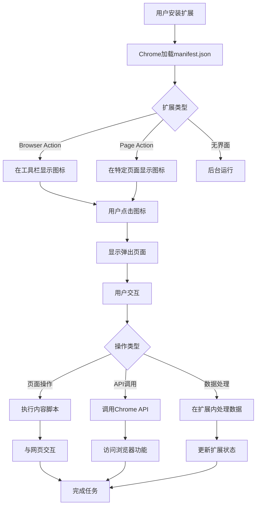
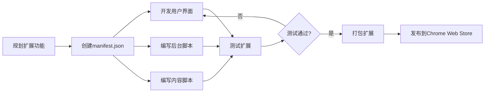

我正在参加CodeBuddy「首席试玩官」内容创作大赛，本文所使用的 CodeBuddy 免费下载链接：[腾讯云代码助手 CodeBuddy - AI 时代的智能编程伙伴](https://copilot.tencent.com/?fromSource=gwzcw.9661261.9661261.9661261&utm_medium=cpc&utm_id=gwzcw.9661261.9661261.9661261&from_column=20421&from=20421)

你好，我是悟空。

## 一、背景

你是否有看过好的技术文章后，回头再找，很难找到的痛苦？

你是否有收藏了一堆好文链接，等下次再次访问的时候，发现网站挂了？

假如有一款工具，直接将网上的文章下载下来，并用 markdown 来存储，以后还可以离线观看，是不是就很舒服了。

这次我们借助 CodeBuddy 来 DIY一款下载文章的Chrome 浏览器扩展，一键转存文章成 markdown 文件。

## 二、Chrome扩展开发原理与流程

### 2.1 Chrome扩展的基本架构

Chrome扩展是基于Web技术（HTML、CSS、JavaScript）构建的软件包，可以扩展Chrome浏览器的功能。以下是Chrome扩展的核心架构和工作原理：

#### 2.1.1 核心组件

```
Chrome扩展
├── Manifest文件 (manifest.json)
├── 用户界面元素
│   ├── 弹出页面 (Popup)
│   ├── 选项页面 (Options)
│   └── 侧边栏 (Sidebar)
├── 后台脚本 (Background Scripts)
├── 内容脚本 (Content Scripts)
├── 资源文件
│   ├── 图标
│   ├── 样式表
│   └── 其他资源
└── Web API访问
```

#### 2.1.2 工作流程图




### 2.2 开发流程图




我们只需要开发一个本地的扩展就行，不需要上传到 Chrome 扩展商店。

## 三、让 CodeBuddy 帮我们写插件

### 3.1 编写 Chrome 扩展

> 提示语：帮我写一个 chrome 插件，将网页内容一键转成 markdown 文件。

然后 CodeBuddy 就开始写插件了。


它主要完成了这几件事情：

1. **扩展程序结构**：Chrome扩展通常需要manifest.json文件、背景脚本、内容脚本和弹出页面
2. **核心功能**：将HTML转换为Markdown的算法
3. **用户交互**：如何触发转换和下载Markdown文件

它会从 0 开始帮我们创建一个 Chrome 插件。

最后生成的文件结构是这样的：


### 3.2 安装 Chrome 扩展

将这个扩展安装到 Chrome 上。


安装方式如下：

1. 打开Chrome浏览器，访问 `chrome://extensions/`
2. 开启右上角的"开发者模式"
3. 点击"加载已解压的扩展程序"
4. 选择包含上述文件的目录

### 3.3 使用扩展

点击这个扩展，就会弹出转换为 Markdown。如下图所示：


点击转换为 Markdown 按钮，就会下载正在查看的这篇网页，并将其转换成 markdown 格式。

如下图所示，这是下载下来的 markdown 文件。


然后预览下文章内容，格式还是不错的。


## 四、问题

### 4.1 扩展的按钮在浏览器上显示乱码。

让 CodeBuddy 帮我们修改，即可解决。


### 4.2 导出的 markdown 文件名中文和英文都被替换成了下划线。

让 CodeBuddy 帮我们修改。


### 4.3 无法生成图片

试过好几次，CodeBuddy 都无法帮我生成 48\*48，不确定是不是网络原因。

解决方案，到这个网站下载免费的图片。

```sh
https://icon-icons.com/
```

## 五、总结

通过本篇我们学习了浏览器扩展的卡发原理和流程、浏览器扩展的代码结构。然后用 CodeBuddy 帮我们写扩展，几分钟就完成了，但是中途也遇到了一些问题，CodeBuddy 都可以帮我们解决。

整体来说 CodeBuddy 在开发浏览器扩展这一块杠杠的！
