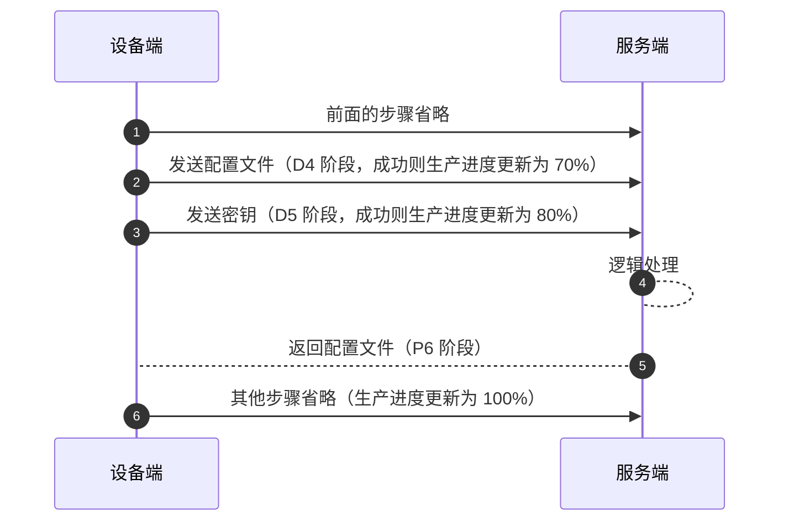

## 卡了一个1024的 Bug，TCP 的包真的看吐了！

你好，我是悟空。

## **一、背景**

最近在预发布环境上遇到一个特别诡异的问题，事情大概是这样的：

设备在生产时需要走一个注册的过程，里面涉及到和服务端进行 TCP 通信获取配置文件、发送密钥等操作，但是生产进度会卡在70%。

流程如下图所示。

大家不用细看里面的原理，只用看 D4 阶段和 D5 阶段即可。

数据通信方式：TCP。




配置文件长这样，key=value 形式存储。

```
name=rabbit
B2=asdf21
...
```

当配置文件中的 name 字段为 `rabbit` 时，设备正常生产，当配置文件中的 name 字段为 `rabbit-TD` 时，设备就无法生产成功，生产进度会卡在 70%。

**从现象来看，不确定是设备端没有执行 D5 阶段，还是服务端没有处理成功处理 D5 阶段。**

## **二、排查过程**

### **2.1、检查代码**

检查下设备端和服务端的代码，有没有对 name 这个字段的长度做一些限制。

**结论：设备端和服务端并没有对配置文件的字段长度做限制。**

### **2.2、查看服务端日志**

排查下服务端的日志，发现只有 D4 阶段的业务日志打印，D5 阶段的日志没有。

**初步结论：设备端没有发送 D5 阶段的数据包。**

### **2.3、服务端抓包**

思路：抓个包看下服务端有没有收到 D5 阶段的数据包。

在服务端通过 microsoft network monitor 抓包工具抓包，然后将抓包文件放到 wireshark 中排查。

下图是设备端和服务端的 TCP 通信数据。


可以看到设备向服务端发送了配置文件（D4阶段），服务端发送了一个 ACK 响应。

> “
>
> 在TCP（传输控制协议）通信中，当客户端发送一条TCP消息给服务端时，服务端通常会发送一个ACK（确认）响应来表明它已经成功接收到了这条消息。这是基于TCP的可靠传输机制，确保数据能够正确无误地从发送方传输到接收方。
>
> TCP使用序列号和确认号来实现可靠传输。发送方会为每个发送的字节分配一个序列号，接收方在收到数据后会发送一个ACK确认，确认号表示接收方期望接收的下一个字节的序列号。如果发送方在一定时间内没有收到ACK确认，它会重新发送数据。（来自 AI）

**初步结论：服务端发送了 D4 阶段的 ACK 响应。设备端没有发送 D5 阶段的数据包**

注意：这个结论在后面的排查过程中被推翻。

### **2.4、设备端抓包**

思路：抓个包看下服务端有没有发送 D5 阶段的数据包。通过如下命令在设备端抓个包：

```
#tcpdump -i fetho host 192.168.1.253
```

抓到的数据包如下所示：


通过上图的抓包结果可以看到最后一个阶段是 D4 和 D5，它俩其实是将数据包合并在一起发送的（这个是我后来才发现的，也是 1024 卡 Bug 产生的源头）

也就是说 D4 和 D5 其实是一个阶段，并没有分开发。

然后设备端一直在等待服务端返回配置文件（P6 阶段）。

**初步结论：设备端执行了 D5 阶段，服务端没有执行 P6 阶段，服务端有问题。**

### **2.5、再查服务端的数据包**

这就尴尬了，设备端明明执行了 D5 阶段，但是服务端看起来没有收到 D5 的数据包。

重新再看下最后一条数据包，报文内容如下图所示：


打开 D4 阶段的数据报文，可以看到数据里面是包含有 D4 阶段的配置文件内容以及D5阶段的文件内容，**当时我看到这个报文是懵的**：

> “
>
> 我看之前的接口文档上写的是 D4 和 D5 阶段分开发送数据？怎么又合在一起发了？
>
> 原因：设备端将 D4和D5 的数据包连续写到 socket 中的。

**初步结论：服务端没有正确处理 D4 和 D5 合体的数据包。**

那怎么办？只能在服务端多加点日志打印看看 D5 的数据包为什么没有正确处理呢。

### **2.6、分析数据包**

#### **3.6.1 name=rabbit 时的报文（可正常生产）**

每个阶段发送一次报文都是按照这样的格式进行发送：0x1234abcd, length, type, data。

- 0x1234abcd : 起始数据
- lenght: 业务数据长度
- type: 请求类型
- data：业务数据

当配置文件中的 name 字段为 `rabbit` 时，报文D4 和 D5 合体后的报文内容如下：


说明：

- **指定的业务数据的长度的值必须和后面的业务数据报文的长度相等**（比如D4阶段的配置文件的数据，D5 阶段的密钥数据的长度），否则会执行报错，这也是导致 D5 阶段未正确执行的根本原因。
- D4 阶段的配置文件的数据的长度为 `0x00 0x00 0x03 0xF4` ，转成十进制就是 1011。
- 服务端在读取 D4 阶段报文时，先读取 4 字节的配置文件数据长度length。然后读取1 字节的请求类型type，最后再只读取 1011 字节的数据data，**如果业务数据的长度不等于 1011 就会报错！**
- D4阶段总共读取了 1016 字节数据。然后执行 D4 阶段的逻辑。
- 接着读取 D5 阶段的 4字节的报文起始数据，然后是 4 字节的业务数据的长度（十六进制 0x00 0x00 0x01 0x00 转成十进制是 256），这里总共读取了 1024 字节的数据，刚刚达到了服务端读取数据的最大长度1024，就会分成下一次读取。如下图所示，完整读取了业务数据的长度。


- 然后读取 1字节的请求类型数据，最后是 256 字节的密钥数据。

#### **3.6.2 name=rabbit-TD 时的报文（不能正常生产）**

当配置文件中的 name 字段为 `rabbit-TD` 时，报文 D4 和 D5 合体后的报文内容如下：


说明：

- D4 阶段的配置文件的数据的长度lenth为 `0x00 0x00 0x03 0xF6` ，转成十进制就是 1014。
- 服务端在读取 D4 阶段报文时，先读取 4 字节的配置文件数据长度，然后读取1 字节的请求类型，最后再只读取 1014 字节的数据，这里总共读取了 1019 字节数据。然后执行 D4 阶段的逻辑。这前面的步骤都没有问题。
- 接着读取 D5 阶段的 4字节的报文起始数据，已经读取了 1023 字节的数据。
- 再读业务数据的长度 lenth，先读取了 1字节，刚好达到服务端读取数据的最大长度 1024，分成下一次读取。**问题就出现在这里，业务数据的长度被分开了！**

日志的内容如下：


- 下一次读取时，会直接读 4 个字节的数据，作为读取业务数据的长度，这里产生了错位，因业务数据的长度length已经被读取了一个字节，就只能往后读取 4 个字节。

- 如下图所示：本来 D5 阶段的业务数据的长度应该是 256 字节，但是因为错位往后读取了一位，把请求类型type的 1 个字节读取了，最后就是 0x00,0x01,0x00,0x02，转成十进制就是 65538，但是 D5 阶段的业务数据只有 256 字节。这就导致传的业务数据的长度和传的业务数据报文长度不一致，所以服务端解析的 D5 的数据报文有问题。如下图所示：

  

日志内容如下：


- 结合上面的说明，来一张完整的报文数据图：


### **2.7、真相大白**

因读取的数据报文达到1024 字节时，将业务数据的长度这四个字节做了切割，前面1024字节包含长度字段的第一个字节，长度字段的后面3个字节和请求类型的 1个字节组成了长度字段的 4 个字节，也就是错位多读取了后面一个字节的内容，最后算出来长度的值为 65538，不等于后面的业务数据的 256 字节，导致服务端的程序报错，所以后续代码就没有执行了。

### **三、解决方案**

### **3.1、方案一**

原因就是前面读取的 length 的 1 个字节没有和后续读取的 length 的三个字节合成长度字段 length 的值，那么只要保证第二次读取长度字段length的时候把之前的 1 个字节拿到即可。

### **3.2、方案二**

**还有一个卡 Bug 的方案：**将 D4 阶段的配置文件增加一点内容，保证配置文件的内容 = 1014 + 1 =1015 即可，或大于等于 1014+5 = 1019，目的就是把长度字段完整的四个字节卡到 1024 后面，或者把起始数据的四个字节也卡在 1024 后面。

验证了两种情况：name 为 Rabbit-TDDDDDDD 和 Rabbit-TDD 是正常生产的。下面是 Rabbit-TDD 的情况，正好将 D4 的数据 + D5 的起始数据卡满了 1024 字节。

如下图所示：

- 左边是出 Rabbit-TD 的日志，系统报错。1023-4-5=1024 或者这样算 1014+5+5=1024。
- 右边是 Rabbit-TDD的日志，右边正常执行。1024-4+4=1024 或者这样算 1015+5+4=1024。


**再来给大家算一遍如何卡 Bug 的，系统能正常运行。**

1024 字节 = 1015（配置文件报文内容） + 4（配置文件报文长度） + 1（请求类型） + 4（D5报文起始数据）。

或

1024 字节 = 1019（配置文件报文内容） + 4（配置文件报文长度） + 1（请求类型）= 1024 字节。

还有两个疑问：

\- D4 阶段的起始数据为啥没有算到 1024 字节中，这里我也没弄懂 Socket的数据是怎么分开、合并发送的。

\- 服务端为什么是读取 1024 字节就会分成下次读取？技术栈是 mina 框架，出问题的是 windows server 2003，而win10上没重现这个问题。

## **四、最后**

我的抓包也是现学现用，肯定有很多不足的地方，欢迎指点。如果文中有计算或者表述问题，也可以指出，一起进步呀！
