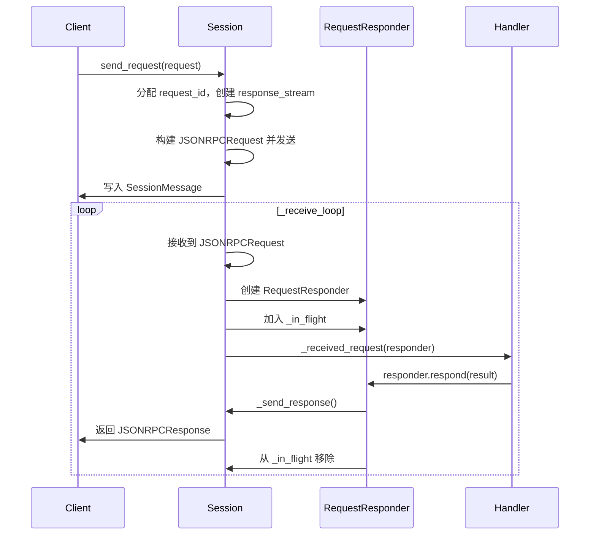
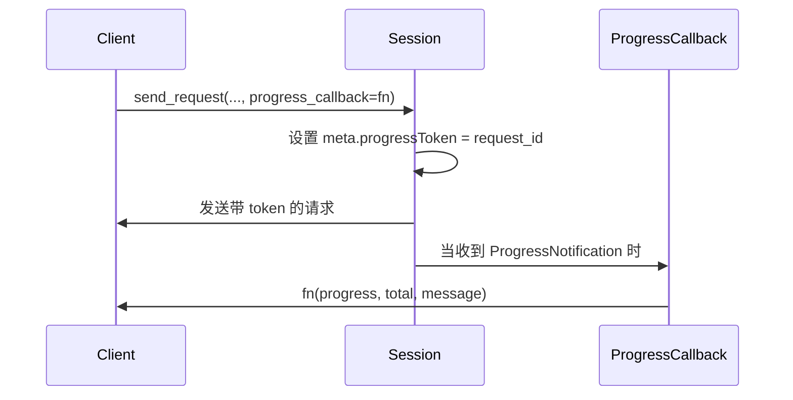
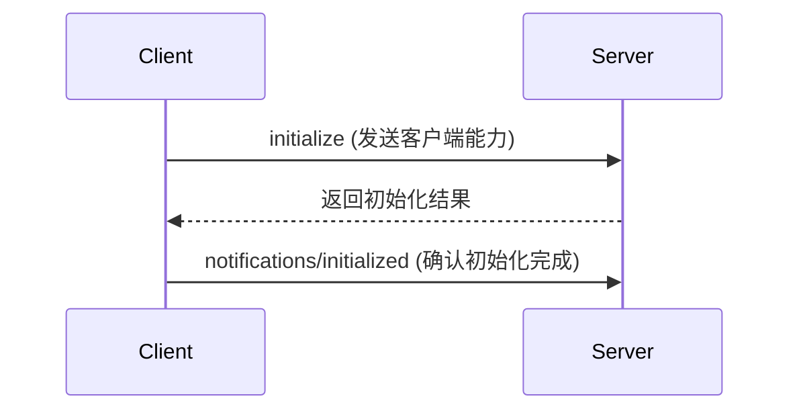
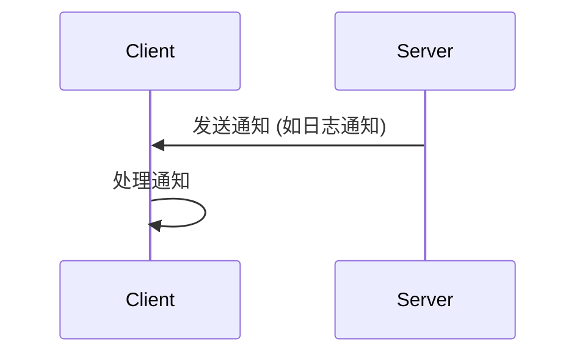
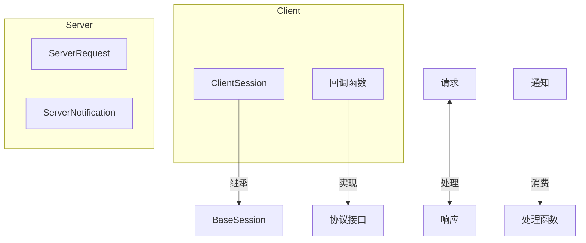
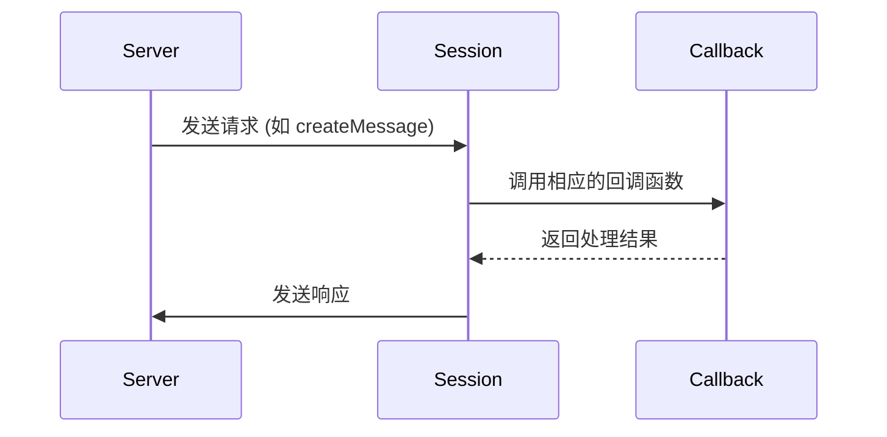
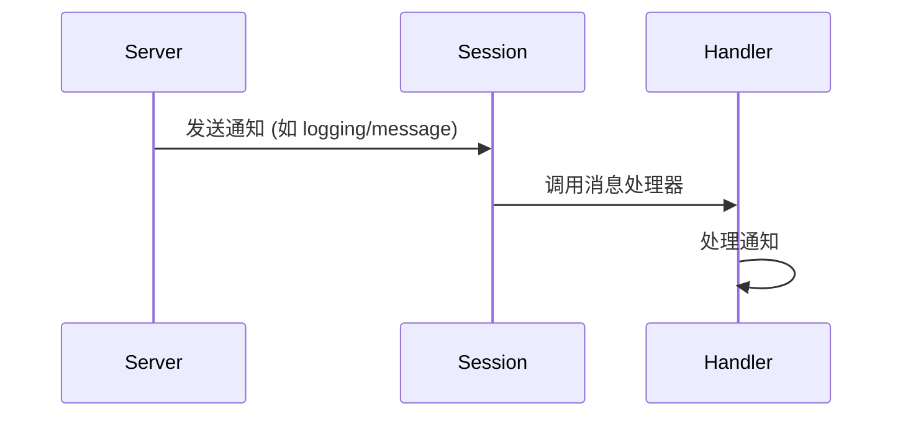
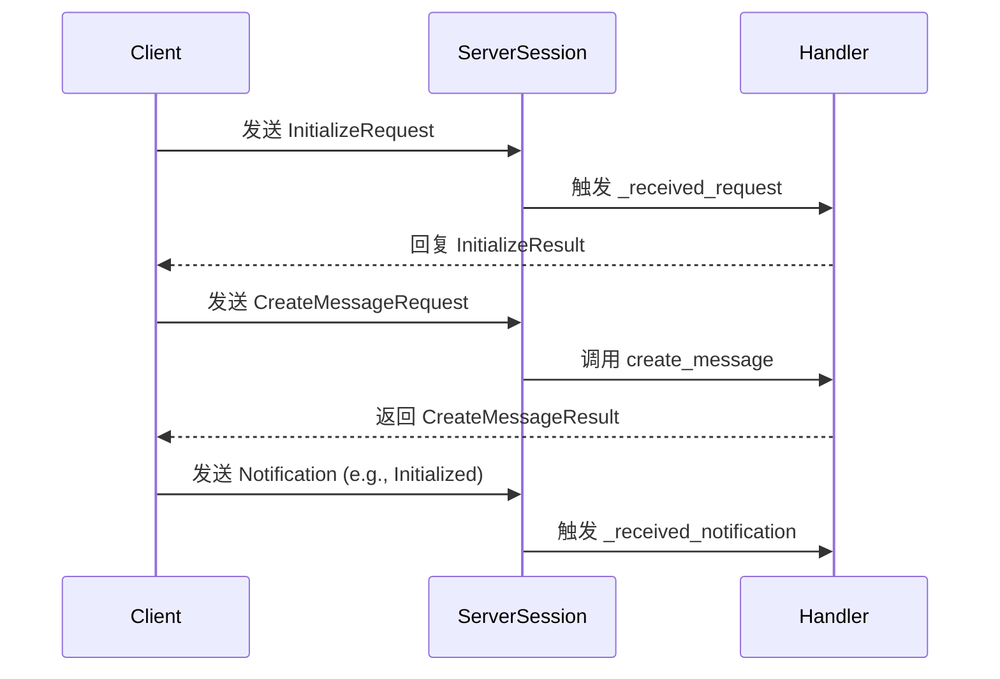

## 文章中的遇到的问题

### 问题 1、Generic 没有这个枚举值 ReceiveResultT

ReceiveResultT # 我们会接收的 Response（Result）类型


### 问题 2、message_handler笔误？应该为 logging_callback

都会统一委托给用户在构造时提供的 message_handler，以便在上层进行监控、界面更新或其他自定义处理。

## 思考题

### 1、如果要在 BaseSession 之外引入一个新的消息优先级机制（比如“紧急通知”要比普通通知先被处理），你会在哪里、如何修改或扩展流程？提示：你可以试着画出在 \_receive_loop 中插入优先级判断的思路。

创建两个内存队列，分别为高、低优先级队列，在 \_receive_loop 判断消息的优先级，如果是高优先级的消息则存放到高优先级队列，低优先级的同理。然后处理消息时，先判断高优先级队列中是否有消息，有则先处理，若高优先级队列没有消息则处理低优先级的队列中消息。

问题：因低优先级消息可能长时间未被处理，会导致消息堆积甚至占满队列。解决方案：可以做一个机制，当低优先级一段时间未处理，则移到高优先级队列。

问题：高优先级队列占满和堆积。解决方案：在入队列之前做一些限流，或进行服务扩容。

### 2、考虑一种场景：你希望在 ClientSession 中统计所有发出的请求和收到的响应的往返时延（RTT），并在超过阈值时发出告警通知。哪些地方最合适插入埋点？

方案 1：在 BaseSession 的 send_request 方法中加上埋点，统计往返时延。（推荐）

方案 2：在 ClientSession 的 所有 self.send_request(xx) 方法的前后加上埋点，统计往返时延。

## 整体原理图

在交互过程中，任何一方都只需像调用本地函数一样发起高层 API 调用。例如，客户端只要执行 await session.list_tools()，ClientSession 就会在内部构造一个 JSON-RPC 请求，将其通过 send_request 发出，并在 ServerSession 的 \_receive_loop 中被接收，随后被封装成一个 RequestResponder 并交给注册在服务器端的工具实现函数处理；工具函数执行完成后调用 responder.respond()，ServerSession 底层的 \_send_response 将结果打包回传，最后在客户端的 send_request 中被捕获并反序列化成 ListToolsResult 返回给调用者。


## Session.py（Cursor 解释）

这个文件 `src/mcp/shared/session.py` 主要实现了一个基于异步流的“会话”机制，常用于客户端与服务端之间的高效异步通信。它大量使用了 Python 的类型注解、泛型、异步编程（async/await）和上下文管理器。下面是主要内容的分解和解释：

---

### 1. 主要依赖和类型定义

- **anyio**：异步并发库，提供流、任务组、取消作用域等。
- **httpx**：HTTP 客户端库，用于处理 HTTP 错误码。
- **pydantic**：数据验证和序列化库。
- **MemoryObjectReceiveStream / MemoryObjectSendStream**：anyio 提供的内存流，用于在内存中异步传递消息。
- **各种类型注解**：如 `SendRequestT`、`SendResultT` 等，用于泛型支持。

---

### 2. ProgressFnT 协议

定义了一个异步回调协议，用于进度通知：

```python
class ProgressFnT(Protocol):
    async def __call__(self, progress: float, total: float | None, message: str | None) -> None: ...
```

---

### 3. RequestResponder 类

用于处理单个请求的响应和生命周期管理，必须作为上下文管理器使用。

- ****enter** / **exit****：进入/退出上下文时，设置和清理取消作用域。
- **respond**：发送响应。
- **cancel**：取消请求并发送取消响应。
- **in_flight / cancelled**：属性，判断请求是否还在处理中或已被取消。

---

### 4. BaseSession 类

这是核心类，实现了基于流的异步会话机制，支持请求/响应、通知、进度回调等。

#### 主要成员变量

- `_read_stream` / `_write_stream`：用于收发消息的内存流。
- `_response_streams`：保存每个请求的响应流。
- `_in_flight`：保存正在处理的请求。
- `_progress_callbacks`：保存进度回调。
- `_task_group`：anyio 的任务组，用于并发处理消息。

#### 主要方法

- ****aenter** / **aexit****：异步上下文管理器，自动启动消息接收循环。
- **send_request**：发送请求并等待响应，支持超时和进度回调。
- **send_notification**：发送通知（不需要响应的消息）。
- **\_send_response**：内部方法，发送响应或错误。
- **\_receive_loop**：核心消息循环，异步接收和分发消息，处理请求、通知、响应等。
- **\_received_request / \_received_notification**：可被子类重写，用于自定义请求/通知的处理逻辑。
- **send_progress_notification**：发送进度通知。
- **\_handle_incoming**：通用的消息处理钩子，通常由子类实现。

---

### 5. 工作流程简述

1. **会话启动**：进入 `BaseSession` 的异步上下文，启动 `_receive_loop`。
2. **消息接收**：不断从 `_read_stream` 读取消息，根据类型分发给不同的处理逻辑。
3. **请求处理**：收到请求后，创建 `RequestResponder`，并调用 `_received_request`。
4. **响应发送**：通过 `respond` 或 `cancel` 方法发送响应。
5. **通知处理**：收到通知后，调用 `_received_notification`，如有进度回调则执行。
6. **异常和关闭**：处理流关闭、超时、参数错误等异常情况。

---

### 6. 适用场景

- 适用于需要高并发、异步、双向通信的场景，如 RPC 框架、微服务通信、异步 API 网关等。

---

### 总结

本文件实现了一个强大、灵活的异步会话框架，支持请求/响应、通知、进度回调、超时、取消等高级特性，适合构建高性能的异步通信系统。

这个文件 [session.py](<javascript:void(0)>) 实现了 MCP（Model Control Protocol）协议的核心会话层功能。它封装了基于异步流的消息通信，支持请求/响应、通知、进度报告等机制，并且提供了上下文管理、超时控制和取消操作的能力。

---

## Sesson.py （通义灵码解释）

### 1. **模块导入与类型定义**

- 使用了 Python 的标准库如 [logging](<javascript:void(0)>), `collections.abc`, `contextlib`, [types](<javascript:void(0)>), `typing` 等。
- 引入第三方库如 `anyio`, `httpx`, `pydantic`, `typing_extensions`。
- 定义泛型类型变量 [SendRequestT](<javascript:void(0)>), [SendResultT](<javascript:void(0)>), [SendNotificationT](<javascript:void(0)>), [ReceiveRequestT](<javascript:void(0)>), [ReceiveNotificationT](<javascript:void(0)>)，用于支持多种消息类型。
- 定义 [RequestId](<javascript:void(0)>) 类型为 `str | int`，用于标识每个请求的唯一 ID。

---

### 2. **ProgressFnT 协议**

```
python

class ProgressFnT(Protocol):
    async def __call__(self, progress: float, total: float | None, message: str | None) -> None:
```

- 用于处理进度通知的回调函数协议。
- 支持传递当前进度、总进度和可选描述信息。

---

### 3. **RequestResponder 类**

该类负责管理一个请求的生命周期，包括响应发送、取消操作、资源清理等。

#### 核心功能：

- ✅ 使用上下文管理器确保资源正确释放。
- ✅ 提供 [respond()](<javascript:void(0)>) 和 [cancel()](<javascript:void(0)>) 方法发送响应或取消请求。
- ✅ 跟踪请求是否完成或被取消。
- ✅ 使用 `anyio.CancelScope` 管理取消逻辑。

#### 属性：

| 属性名                                 | 类型              | 描述                       |
| :------------------------------------- | :---------------- | :------------------------- |
| [\_completed](<javascript:void(0)>)    | bool              | 请求是否已完成             |
| [\_cancel_scope](<javascript:void(0)>) | anyio.CancelScope | 控制请求取消作用域         |
| [in_flight](<javascript:void(0)>)      | bool              | 请求是否在飞行中（未完成） |
| [cancelled](<javascript:void(0)>)      | bool              | 请求是否已被取消           |

---

### 4. **BaseSession 类**

这是整个会话系统的核心类，实现了完整的 MCP 协议会话行为。

#### 构造函数参数：

| 参数名                      | 类型                                      | 描述             |
| :-------------------------- | :---------------------------------------- | :--------------- |
| `read_stream`               | MemoryObjectReceiveStream[SessionMessage] | 接收消息的输入流 |
| `write_stream`              | MemoryObjectSendStream[SessionMessage]    | 发送消息的输出流 |
| `receive_request_type`      | type[ReceiveRequestT]                     | 接收请求的类型   |
| `receive_notification_type` | type[ReceiveNotificationT]                | 接收通知的类型   |
| `read_timeout_seconds`      | timedelta                                 | None             |

#### 主要方法：

##### 👉 [**aenter**](<javascript:void(0)>), [**aexit**](<javascript:void(0)>)

- 异步上下文管理器实现，自动启动接收循环。
- 使用 `anyio.create_task_group()` 管理异步任务。

##### 👉 [send_request(...)](<javascript:void(0)>)

- 发送请求并等待响应。
- 支持设置超时、元数据、进度回调。
- 自动分配 [request_id](<javascript:void(0)>)，创建响应通道 `response_stream`。
- 如果设置了 `progress_callback`，则绑定到 `_meta.progressToken` 上。

##### 👉 [send_notification(...)](<javascript:void(0)>)

- 发送不需响应的通知消息。
- 可指定 `related_request_id` 来关联某个请求。

##### 👉 [\_send_response(...)](<javascript:void(0)>)

- 向客户端发送响应或错误。
- 支持 JSON-RPC 规范格式。

##### 👉 [\_receive_loop(...)](<javascript:void(0)>)

- 接收消息的主循环：
  - 处理请求、通知、响应、异常。
  - 对于请求：验证后创建 [RequestResponder](<javascript:void(0)>) 并触发 [\_received_request()](<javascript:void(0)>)。
  - 对于通知：调用 [\_received_notification()](<javascript:void(0)>) 或处理取消/进度通知。
  - 对于响应：转发给对应的 `response_stream`。
  - 断开连接时清理所有未完成的请求。

##### 👉 [\_received_request(...)](<javascript:void(0)>), [\_received_notification(...)](<javascript:void(0)>)

- 子类可重写这些方法以自定义请求/通知处理逻辑。

##### 👉 [send_progress_notification(...)](<javascript:void(0)>)

- 发送进度通知，通过 `progress_token` 找到对应的回调函数执行。

##### 👉 [\_handle_incoming(...)](<javascript:void(0)>)

- 默认的消息处理器，子类可重写以自定义处理逻辑。

---

### 原理图与时序图

#### 🔁 整体架构原理图

```
+-----------------------------+
|        BaseSession          |
|                             |
| - read_stream               |
| - write_stream              |
| - _response_streams         |
| - _in_flight (active reqs)  |
| - _progress_callbacks       |
+---------+-------------------+
          |
          v
+---------+--------+      +--------------------+
| RequestResponder  |<----|   send_request()   |
| - respond()       |      +--------------------+
| - cancel()        |
+-------------------+
          |
          v
+---------+--------+
| _receive_loop()  |
| - process msg    |
| - dispatch req/ntf|
+------------------+
```

---

#### 📈 请求/响应完整流程时序图



---

#### 📉 进度通知流程时序图



---

### 📌 总结

这个文件实现了 MCP 协议的核心会话机制，具备以下特点：

| 特性           | 是否支持 |
| :------------- | :------- |
| 异步上下文管理 | ✅       |
| 请求/响应模型  | ✅       |
| 通知机制       | ✅       |
| 进度回调       | ✅       |
| 请求取消       | ✅       |
| 超时控制       | ✅       |
| 异常处理       | ✅       |

适用于构建高性能、可扩展的 AI 控制服务端点。

## BaseSession 子类 ClientSession

```PYTHON
class ClientSession(
    BaseSession[
        types.ClientRequest,
        types.ClientNotification,
        types.ClientResult,
        types.ServerRequest,
        types.ServerNotification,
    ]
):
```

这段代码定义了一个 [ClientSession](<javascript:void(0)>) 类，它继承自泛型类 [BaseSession](<javascript:void(0)>)，并指定了五个类型参数，分别代表：

- 客户端请求类型 (`types.ClientRequest`)
- 客户端通知类型 (`types.ClientNotification`)
- 客户端结果类型 (`types.ClientResult`)
- 服务端请求类型 (`types.ServerRequest`)
- 服务端通知类型 (`types.ServerNotification`)

作用：为客户端会话设置具体的输入输出消息类型。

### 一、总体概述

这是一个 Python 实现的客户端会话层代码，用于实现 [MCP](https://github.com/withcatai/mcp) (Model Collaboration Protocol) 协议。该文件定义了 [ClientSession](<javascript:void(0)>) 类，它是与服务端通信的核心类。

### 二、主要组成部分解析

#### 1. 导入和类型定义

```python
from datetime import timedelta
from typing import Any, Protocol

import anyio.lowlevel
from anyio.streams.memory import MemoryObjectReceiveStream, MemoryObjectSendStream
from pydantic import AnyUrl, TypeAdapter

import mcp.types as types
from mcp.shared.context import RequestContext
from mcp.shared.message import SessionMessage
from mcp.shared.session import BaseSession, ProgressFnT, RequestResponder
from mcp.shared.version import SUPPORTED_PROTOCOL_VERSIONS
```

- 导入必要的依赖库和自定义模块
- 定义默认客户端信息：`DEFAULT_CLIENT_INFO = types.Implementation(name="mcp", version="0.1.0")`

#### 2. 回调函数协议定义

定义了一系列回调函数协议，用于处理不同类型的服务器请求：

- `SamplingFnT`: 采样请求回调协议
- `ElicitationFnT`: 获取信息请求回调协议
- `ListRootsFnT`: 列出根目录请求回调协议
- `LoggingFnT`: 日志通知回调协议
- `MessageHandlerFnT`: 消息处理器协议

#### 3. 默认回调实现

实现了上述协议的默认回调函数：

- `_default_message_handler`: 默认消息处理器
- `_default_sampling_callback`: 默认采样回调（不支持）
- `_default_elicitation_callback`: 默认获取信息回调（不支持）
- `_default_list_roots_callback`: 默认列出根目录回调（不支持）
- `_default_logging_callback`: 默认日志回调

#### 4. `ClientSession` 类

继承自 `BaseSession`，实现了客户端特定的功能，主要包括：

##### 构造函数

```python
def __init__(
    self,
    read_stream: MemoryObjectReceiveStream[SessionMessage | Exception],
    write_stream: MemoryObjectSendStream[SessionMessage],
    read_timeout_seconds: timedelta | None = None,
    sampling_callback: SamplingFnT | None = None,
    elicitation_callback: ElicitationFnT | None = None,
    list_roots_callback: ListRootsFnT | None = None,
    logging_callback: LoggingFnT | None = None,
    message_handler: MessageHandlerFnT | None = None,
    client_info: types.Implementation | None = None,
)
```

初始化会话所需的各种参数和回调函数

##### 初始化方法

```python
async def initialize(self) -> types.InitializeResult:
```

发送初始化请求，建立与服务端的连接，并验证协议版本

##### 各种请求方法

实现了 MCP 协议定义的各种客户端请求方法：

- `send_ping`: 发送 ping 请求
- `send_progress_notification`: 发送进度通知
- `set_logging_level`: 设置日志级别
- `list_resources`: 列出资源
- `list_resource_templates`: 列出资源模板
- `read_resource`: 读取资源
- `subscribe_resource` / `unsubscribe_resource`: 订阅/取消订阅资源
- `call_tool`: 调用工具
- `list_prompts` / `get_prompt`: 管理提示
- `complete`: 完成操作
- `list_tools`: 列出可用工具
- `send_roots_list_changed`: 发送根列表变更通知

##### 请求处理

```python
async def _received_request(self, responder: RequestResponder[types.ServerRequest, types.ClientResult]) -> None:
```

处理来自服务端的请求，根据请求类型调用相应的回调函数

##### 消息处理

```python
async def _handle_incoming(self, req: RequestResponder[types.ServerRequest, types.ClientResult] | types.ServerNotification | Exception)
```

处理所有传入的消息，转发给消息处理器

##### 通知处理

```python
async def _received_notification(self, notification: types.ServerNotification)
```

处理来自服务端的通知，特别是日志通知

### 三、工作原理

#### 1. 会话建立流程



#### 2. 请求-响应流程

```
mermaid

sequenceDiagram
    participant Client
    participant Server

    Client->>Server: 发送请求 (如 ping)
    Server-->>Client: 返回响应
```

#### 3. 通知流程



### 四、核心设计模式

#### 1. 观察者模式

通过回调函数机制实现观察者模式，允许客户端注册自己的处理函数来处理服务端的请求。

#### 2. 模板方法模式

继承自 [BaseSession](<javascript:void(0)>) 并实现具体的请求处理逻辑，体现了模板方法模式。

#### 3. 策略模式

通过注入不同的回调函数实现策略模式，允许客户端自定义行为。

### 五、架构图



### 六、时序图

#### 1. 初始化流程

```
mermaid

sequenceDiagram
    participant Client
    participant Session
    participant Server

    Client->>Session: 创建 ClientSession
    Session->>Session: 初始化回调函数
    Client->>Session: 调用 initialize()
    Session->>Server: 发送 initialize 请求
    Server-->>Session: 返回协议版本和能力
    Session->>Session: 验证协议版本
    Session->>Server: 发送 initialized 通知
    Session-->>Client: 返回初始化结果
```

#### 2. 请求处理流程



#### 3. 通知处理流程



这个实现提供了一个完整的 MCP 客户端会话层，能够处理各种类型的请求和通知，并提供了灵活的回调机制供客户端自定义行为。

## ServerSession

该文件 [session.py](<javascript:void(0)>) 实现了 MCP（Model Context Protocol）协议中服务器端的核心会话管理类 [ServerSession](<javascript:void(0)>)，负责与客户端之间的通信、请求处理、能力协商等关键功能。

---

### 📌 一、代码功能详解

#### 🔹 1. 模块导入与说明

```
python

from enum import Enum
from typing import Any, TypeVar

import anyio
import anyio.lowlevel
from anyio.streams.memory import MemoryObjectReceiveStream, MemoryObjectSendStream
from pydantic import AnyUrl

import mcp.types as types
from mcp.server.models import InitializationOptions
from mcp.shared.message import ServerMessageMetadata, SessionMessage
from mcp.shared.session import BaseSession, RequestResponder
from mcp.shared.version import SUPPORTED_PROTOCOL_VERSIONS
```

- **anyio**：用于异步流和协程管理。
- **MemoryObjectStream**：内存中的异步数据流，用于在会话内部传递消息。
- **types**：MCP 协议定义的类型，如请求、响应、通知等。
- **InitializationOptions**：服务器初始化配置选项。
- **BaseSession**：基础会话类，提供基本的发送/接收逻辑。

---

#### 🔹 2. 类型定义与枚举

```
python

class InitializationState(Enum):
    NotInitialized = 1
    Initializing = 2
    Initialized = 3
```

表示当前会话的初始化状态，用于控制初始化流程。

---

#### 🔹 3. [ServerSession](<javascript:void(0)>) 类继承结构

```
python

class ServerSession(
    BaseSession[
        types.ServerRequest,
        types.ServerNotification,
        types.ServerResult,
        types.ClientRequest,
        types.ClientNotification,
    ]
)
```

- 继承自 BaseSession，泛型参数指定了：

  - 服务端发送的请求类型：`ServerRequest`
  - 服务端发送的通知类型：`ServerNotification`
  - 服务端返回的结果类型：`ServerResult`
  - 客户端发送的请求类型：`ClientRequest`
  - 客户端发送的通知类型：`ClientNotification`

---

#### 🔹 4. 初始化方法

```
python

def __init__(
    self,
    read_stream: MemoryObjectReceiveStream[...],
    write_stream: MemoryObjectSendStream[...],
    init_options: InitializationOptions,
    stateless: bool = False,
) -> None:
```

- 构造函数设置读写流、初始化状态、初始化选项；
- 创建了一个用于接收客户端消息的异步通道 `_incoming_message_stream`。

---

#### 🔹 5. 属性与核心方法

##### ✅ `client_params`

```
python

@property
def client_params(self) -> types.InitializeRequestParams | None:
    return self._client_params
```

获取客户端在初始化时提供的参数信息。

##### ✅ `check_client_capability`

```
python

def check_client_capability(self, capability: types.ClientCapabilities) -> bool:
```

检查客户端是否支持指定的能力（如采样、提示词列表、资源订阅等），用于条件执行逻辑。

---

#### 🔹 6. 请求处理逻辑

##### ✅ `_received_request`

```
python

async def _received_request(self, responder: RequestResponder[types.ClientRequest, types.ServerResult]):
```

处理来自客户端的请求：

- 匹配请求类型（如 `InitializeRequest`）
- 如果是初始化请求，则更新状态并保存客户端参数
- 返回相应的结果给客户端

##### ✅ `_received_notification`

```
python

async def _received_notification(self, notification: types.ClientNotification) -> None:
```

处理客户端发来的通知，例如 `InitializedNotification`，用于状态变更。

---

#### 🔹 7. 各类发送请求的方法

这些方法用于服务端主动向客户端发起请求或通知：

| 方法名                                        | 功能描述                     |
| :-------------------------------------------- | :--------------------------- |
| [send_log_message](<javascript:void(0)>)      | 发送日志消息通知             |
| [send_resource_updated](<javascript:void(0)>) | 资源更新通知                 |
| [create_message](<javascript:void(0)>)        | 创建消息请求（调用模型生成） |
| [list_roots](<javascript:void(0)>)            | 列出根节点                   |
| [elicit](<javascript:void(0)>)                | 获取用户输入（交互式对话）   |
| [send_ping](<javascript:void(0)>)             | 心跳检测                     |

---

#### 🔹 8. 内部消息流转机制

使用 `self._incoming_message_stream_writer` 和 `self._incoming_message_stream_reader` 在会话内部传递请求/通知，便于外部监听或处理。

---

### 📈 二、工作原理图解

#### 🔄 会话生命周期图（UML 状态图）

```
+-------------------+
|   NotInitialized  |
+-------------------+
          |
          | 接收到 InitializeRequest
          v
+-------------------+
|    Initializing   |
+-------------------+
          |
          | 成功初始化
          v
+-------------------+
|    Initialized    |
+-------------------+
```

---

#### ⚙️ 会话请求处理流程（时序图）



---

### 🧩 三、关键设计模式解析

| 设计模式       | 应用场景                                                   |
| :------------- | :--------------------------------------------------------- |
| **模板方法**   | `BaseSession` 提供通用框架，子类实现具体逻辑               |
| **观察者模式** | 使用 `_incoming_message_stream` 分发事件给多个消费者       |
| **策略模式**   | 根据客户端能力选择不同行为（如 `check_client_capability`） |
| **责任链模式** | 多个请求处理器按顺序尝试处理不同类型的消息                 |

---

### 📝 总结

这个模块实现了 MCP 协议中服务端的核心通信机制，包括：

- 异步消息流管理
- 客户端初始化流程控制
- 能力协商机制
- 请求/响应/通知的标准处理
- 可扩展的回调机制（通过 Stream 分发）

它是构建 MCP 服务端应用的基础组件，开发者可以通过继承 [ServerSession](<javascript:void(0)>) 或使用其封装接口来实现自己的业务逻辑。
