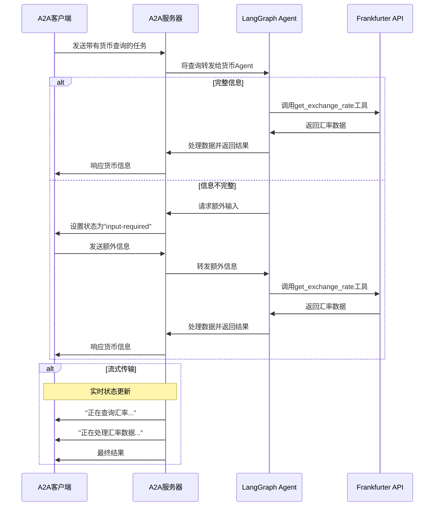

## 基于A2A协议的LangGraph货币Agent

🤔 思考题第 1 题

问题：目前，LangGraph Agent 的 V2 版本实现了意图识别能力，但是使用简单的模板化回复，直接拼接字符串生成响应，响应内容相对固定和简单。你可否改造一下，使用 LLM 生成智能回复，让响应内容更加个性化和友好。

🌈解答 ：我只看了下老师写的代码，核心思路就是从响应中拿到传入的汇率参数，然后拼接到 prompt 中，然后传给大模型。

🤔 思考题第 2 题

问题：LangGraph Agent 的 V2 版本和 A2A Sample 中的 Agent.py 从工作流程控制方面有哪些差异？在你的工作场景中，你比较倾向于选择哪种实现方式，为什么？

🌈 解答：

V2 版本更灵活，手动构建 StateGraph ，可以自由添加节点和边。

而 Agent.py 用的标准的工作流程控制， ReAct 模式 Agent，用到的 create_react_agent 方法不直接提供参数来传入自定义的条件边和循环边。

工作场景：

- 手动构建 StateGraph 的场景：
  - 复杂的多步骤 Agent
  - 多 Agent 协作系统
  - 需要人类介入的流程
  - 自定义决策逻辑
- 标准的 ReAct 模式 Agent 实现的 LangGraph Agent
  - 简单且标准的工具使用 Agent
  - 快速原型开发
  - 学习 LangGraph 的起点

🌟文中有个点其实没有细讲：

当在 langgraph_zh/agent.py 文件中调用 `create_react_agent` 并传入模型、工具、checkpointer 和 prompt 时，它会在内部自动创建一个 LangGraph 图，这个图通常包含以下几个隐式节点和边。

### ☁️ Demo 运行方式

demo 代码在这里：https://github.com/huangjia2019/a2a-in-action

#### 运行直接调用demo

cd agents/langgraph_zh

python 02_LangGraph_Currency-v1-直接调用.py

#### 运行意图识别 demo

cd agents/langgraph_zh

python 02_LangGraph_Currency-v2-意图识别.py

#### 运行智能回复 demo

cd agents/langgraph_zh

python 02_LangGraph_Currency-v3-智能回复.py

#### LangGraph Agent 和 A2A 的集成 demo

启动一个终端

cd agents/langgraph_zh

uv run .

启动另外一个终端

cd demo/ui

uv run main.py

### 问题

1、google.genai.errors.ClientError: 400 FAILED_PRECONDITION. {'error': {'code': 400, 'message': 'User location is not supported for the API use.', 'status': 'FAILED_PRECONDITION'}}

换一个地区。

#### 2、访问不了汇率计算网站 frankfurter

- 切换代理
- 本地安装 docker 版本的 frankfurter 。

```SH
docker run -d -p 8026:8080 lineofflight/frankfurter
```

修改文件：a2a-in-action/agents/langgraph/agent.py


测试结果


#### 3、agent.py 文件中，langgraph 我知道是需要创建 node 和 边的，但是这个里面咋没用到呢？

你观察得很对！在这个 `CurrencyAgent` 的实现中，你确实没有直接看到 `langgraph.graph.StateGraph`、`add_node` 或 `add_edge` 这些用于显式定义节点和边的方法。

这是因为 `langgraph.prebuilt.create_react_agent` 是一个**预构建的（prebuilt）**函数。它**内部**已经封装了 ReAct 代理所需的标准节点和边逻辑。它的设计目的是为了简化 ReAct 模式的实现，让你不需要手动去构建底层的图结构。

当你调用 `create_react_agent` 并传入模型、工具、checkpointer 和 prompt 时，它会在内部自动创建一个 LangGraph 图，这个图通常包含以下几个隐式节点和边：

1.  **Agent 节点（或 LLM 节点）**：负责接收用户输入和历史消息，调用语言模型进行推理，并决定下一步是调用工具还是直接给出最终答案。
2.  **工具节点（Tool Node）**：如果 Agent 决定调用工具，请求会路由到这个节点，负责执行实际的工具函数（例如 `get_exchange_rate`）。
3.  **条件边**：连接 Agent 节点和工具节点（以及最终的结束节点）。这条边会根据语言模型的输出（是否有工具调用）来决定下一步的执行路径。如果模型有工具调用，就路由到工具节点；如果没有，就路由到结束节点。
4.  **循环边**：从工具节点回到 Agent 节点。这意味着在工具执行完毕后，结果会返回给 Agent，让 Agent 根据工具的输出进行进一步的推理或生成最终响应。

简单来说，`create_react_agent` 帮你“搭好了骨架”，隐藏了底层的图构建细节，让你能更专注于 Agent 的业务逻辑（即工具的定义和系统指令）。如果你需要更精细地控制 Agent 的行为，或者构建更复杂的流程（例如多 Agent 协作、人类参与循环等），那么你就需要手动使用 `StateGraph`、`add_node` 和 `add_edge` 来定制自己的图。

这个 `CurrencyAgent` 案例是一个很好的起点，因为它展示了 LangGraph 如何通过高级抽象来简化常见 Agent 模式的实现。

#### 可以传入条件边和循环边吗？

`create_react_agent` 函数**不直接提供**参数来让你传入自定义的条件边和循环边。

如前面所解释的，`create_react_agent` 是一个高级抽象，它内部已经预定义了 ReAct 模式所需的节点和边的逻辑。它的目的是让你能够快速搭建一个标准的 ReAct Agent，而无需关心底层的图结构。

如果你需要：

- **自定义 Agent 的决策逻辑**：比如除了工具调用和最终响应之外，还有其他的中间状态或决策分支。
- **实现更复杂的流程**：例如多步骤的工具链、人类参与循环（human-in-the-loop）、子图（subgraph）等。
- **精细控制每个节点的输入输出和转换**。

那么，你就需要放弃使用 `create_react_agent`，转而使用 LangGraph 的核心组件，即 `langgraph.graph.StateGraph`，并手动使用 `add_node`、`add_edge` 和 `add_conditional_edges` 来构建你的图。

通过手动构建 `StateGraph`，你将拥有完全的灵活性来定义任何你需要的节点和它们之间的连接关系，包括复杂的条件和循环逻辑。

### Demo 文件结构

```
langgraph_zh/
├── 01_LangGraph_Simple.py          # 极简LangGraph Agent示例
├── 02_LangGraph_Currency_Agent.py  # 汇率兑换Agent单机版
├── 03_Test_LangGraph_Agent.py      # 测试套件
├── generate_flowchart.py           # 生成工作流流程图
├── agent.py                        # 原始A2A协议Agent
├── task_manager.py                 # 任务管理器
├── __main__.py                     # 主入口文件
└── README.md                       # 说明文档
```

此示例演示了一个使用[LangGraph](https://langchain-ai.github.io/langgraph/)构建并通过A2A协议暴露的货币转换Agent。它展示了支持多轮对话和流式响应的对话交互。

### 快速开始

#### 1. 极简LangGraph Agent示例

运行极简示例来了解LangGraph的基本用法：

```bash
cd agents/langgraph_zh
python 01_LangGraph_Simple.py
```

这个示例展示了：

- 基本的LangGraph工作流创建
- 状态管理
- 简单的Agent节点实现

#### 2. 汇率兑换Agent单机版

运行汇率兑换Agent演示：

```bash
python 02_LangGraph_Currency_Agent.py
```


这个示例展示了：

- 多节点工作流设计
- 工具集成（汇率API）
- 错误处理和状态管理
- 会话管理

#### 3. 运行测试套件

执行完整的测试：

```bash
python 03_Test_LangGraph_Agent.py
```

#### 4. 生成流程图（没找到这个文件）

生成工作流可视化图表：

```bash
python generate_flowchart.py
```

需要安装graphviz：

```bash
pip install graphviz
```

### 与CrewAI的对比

| 特性       | CrewAI          | LangGraph       |
| ---------- | --------------- | --------------- |
| 工作流模型 | Agent-Task-Crew | State-Node-Edge |
| 状态管理   | 隐式            | 显式状态图      |
| 流程控制   | 顺序执行        | 灵活的条件分支  |
| 复杂度     | 简单直观        | 更灵活但复杂    |
| 适用场景   | 协作任务        | 复杂工作流      |

### 工作原理

此Agent使用LangGraph和Google Gemini通过ReAct Agent模式提供货币汇率信息。A2A协议实现了与Agent的标准化交互，允许客户端发送请求并接收实时更新。



### 核心功能

- **多轮对话**: Agent可以在需要时请求额外信息
- **实时流式传输**: 在处理过程中提供状态更新
- **推送通知**: 支持基于webhook的通知
- **对话记忆**: 在交互过程中维护上下文
- **货币汇率工具**: 集成Frankfurter API获取实时汇率

### 前置要求

- Python 3.13或更高版本
- [UV](https://docs.astral.sh/uv/)
- 访问LLM和API密钥

### 设置和运行

1. 导航到示例目录：

   ```bash
   cd samples/python/agents/langgraph
   ```

2. 使用您的API密钥创建环境文件：

   ```bash
   echo "GOOGLE_API_KEY=your_api_key_here" > .env
   ```

3. 运行Agent：

   ```bash
   # 在默认端口10000上基本运行
   uv run .

   # 在自定义主机/端口上
   uv run . --host 0.0.0.0 --port 8080
   ```


1. 在单独的终端中，运行A2A[客户端](/samples/python/hosts/README.md)：

   ```bash
   cd samples/python/hosts/cli
   uv run .
   ```

直接用 demo/ui

uv run main.py


### 技术实现

- **LangGraph ReAct Agent**: 使用ReAct模式进行推理和工具使用
- **流式传输支持**: 在处理过程中提供增量更新
- **检查点记忆**: 在轮次之间维护对话状态
- **推送通知系统**: 基于webhook的更新，支持JWK认证
- **A2A协议集成**: 完全符合A2A规范

### 限制

- 仅支持基于文本的输入/输出（无多模态支持）
- 使用Frankfurter API，货币选项有限
- 内存基于会话，在服务器重启之间不持久化

## 示例

**同步请求**

请求：

```
POST http://localhost:10000
Content-Type: application/json

{
  "jsonrpc": "2.0",
  "id": 11,
  "method": "tasks/send",
  "params": {
    "id": "129",
    "sessionId": "8f01f3d172cd4396a0e535ae8aec6687",
    "acceptedOutputModes": [
      "text"
    ],
    "message": {
      "role": "user",
      "parts": [
        {
          "type": "text",
          "text": "1 USD兑换INR的汇率是多少？"
        }
      ]
    }
  }
}
```

响应：

```
{
  "jsonrpc": "2.0",
  "id": 11,
  "result": {
    "id": "129",
    "status": {
      "state": "completed",
      "timestamp": "2025-04-02T16:53:29.301828"
    },
    "artifacts": [
      {
        "parts": [
          {
            "type": "text",
            "text": "1 USD兑换INR的汇率是85.49。"
          }
        ],
        "index": 0
      }
    ],
    "history": []
  }
}
```

**多轮示例**

请求 - 序列1：

```
POST http://localhost:10000
Content-Type: application/json

{
  "jsonrpc": "2.0",
  "id": 10,
  "method": "tasks/send",
  "params": {
    "id": "130",
    "sessionId": "a9bb617f2cd94bd585da0f88ce2ddba2",
    "acceptedOutputModes": [
      "text"
    ],
    "message": {
      "role": "user",
      "parts": [
        {
          "type": "text",
          "text": "1 USD的汇率是多少？"
        }
      ]
    }
  }
}
```

响应 - 序列2：

```
{
  "jsonrpc": "2.0",
  "id": 10,
  "result": {
    "id": "130",
    "status": {
      "state": "input-required",
      "message": {
        "role": "agent",
        "parts": [
          {
            "type": "text",
            "text": "Which currency do you want to convert to? Also, do you want the latest exchange rate or a specific date?"
          }
        ]
      },
      "timestamp": "2025-04-02T16:57:02.336787"
    },
    "history": []
  }
}
```

Request - Seq 3:

```
POST http://localhost:10000
Content-Type: application/json

{
  "jsonrpc": "2.0",
  "id": 10,
  "method": "tasks/send",
  "params": {
    "id": "130",
    "sessionId": "a9bb617f2cd94bd585da0f88ce2ddba2",
    "acceptedOutputModes": [
      "text"
    ],
    "message": {
      "role": "user",
      "parts": [
        {
          "type": "text",
          "text": "CAD"
        }
      ]
    }
  }
}
```

Response - Seq 4:

```
{
  "jsonrpc": "2.0",
  "id": 10,
  "result": {
    "id": "130",
    "status": {
      "state": "completed",
      "timestamp": "2025-04-02T16:57:40.033328"
    },
    "artifacts": [
      {
        "parts": [
          {
            "type": "text",
            "text": "The current exchange rate is 1 USD = 1.4328 CAD."
          }
        ],
        "index": 0
      }
    ],
    "history": []
  }
}
```

**Streaming example**

Request:

```
{
  "jsonrpc": "2.0",
  "id": 12,
  "method": "tasks/sendSubscribe",
  "params": {
    "id": "131",
    "sessionId": "cebd704d0ddd4e8aa646aeb123d60614",
    "acceptedOutputModes": [
      "text"
    ],
    "message": {
      "role": "user",
      "parts": [
        {
          "type": "text",
          "text": "How much is 100 USD in GBP?"
        }
      ]
    }
  }
}
```

Response:

```
data: {"jsonrpc":"2.0","id":12,"result":{"id":"131","status":{"state":"working","message":{"role":"agent","parts":[{"type":"text","text":"Looking up the exchange rates..."}]},"timestamp":"2025-04-02T16:59:34.578939"},"final":false}}

data: {"jsonrpc":"2.0","id":12,"result":{"id":"131","status":{"state":"working","message":{"role":"agent","parts":[{"type":"text","text":"Processing the exchange rates.."}]},"timestamp":"2025-04-02T16:59:34.737052"},"final":false}}

data: {"jsonrpc":"2.0","id":12,"result":{"id":"131","artifact":{"parts":[{"type":"text","text":"Based on the current exchange rate, 1 USD is equivalent to 0.77252 GBP. Therefore, 100 USD would be approximately 77.252 GBP."}],"index":0,"append":false}}}

data: {"jsonrpc":"2.0","id":12,"result":{"id":"131","status":{"state":"completed","timestamp":"2025-04-02T16:59:35.331844"},"final":true}}
```

### Learn More

- [A2A Protocol Documentation](https://google.github.io/A2A/#/documentation)
- [LangGraph Documentation](https://langchain-ai.github.io/langgraph/)
- [Frankfurter API](https://www.frankfurter.app/docs/)
- [Google Gemini API](https://ai.google.dev/gemini-api)
