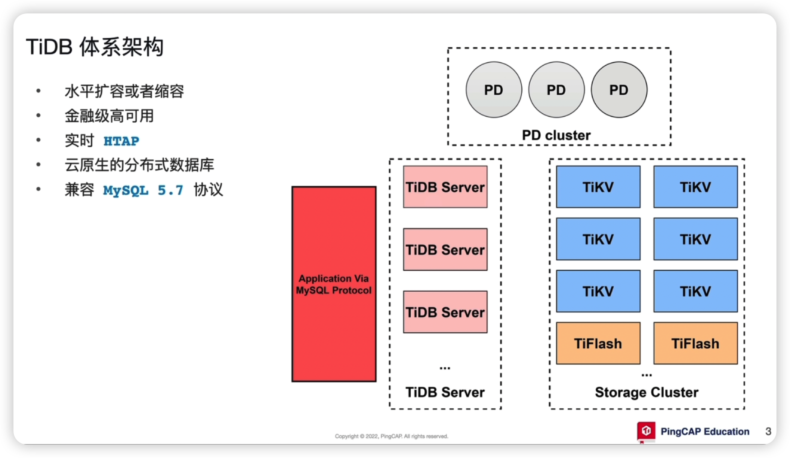
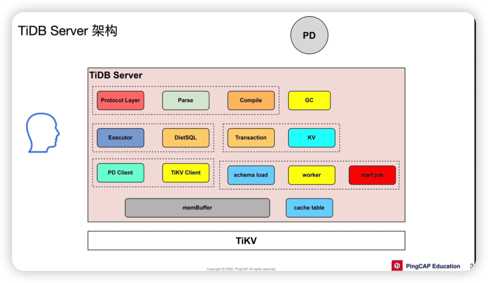
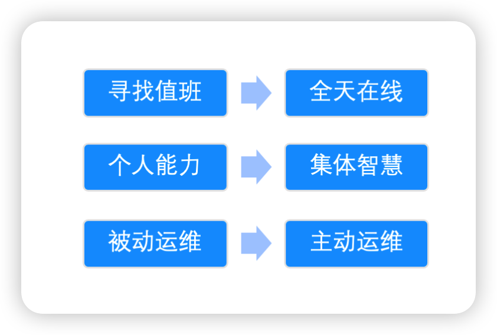
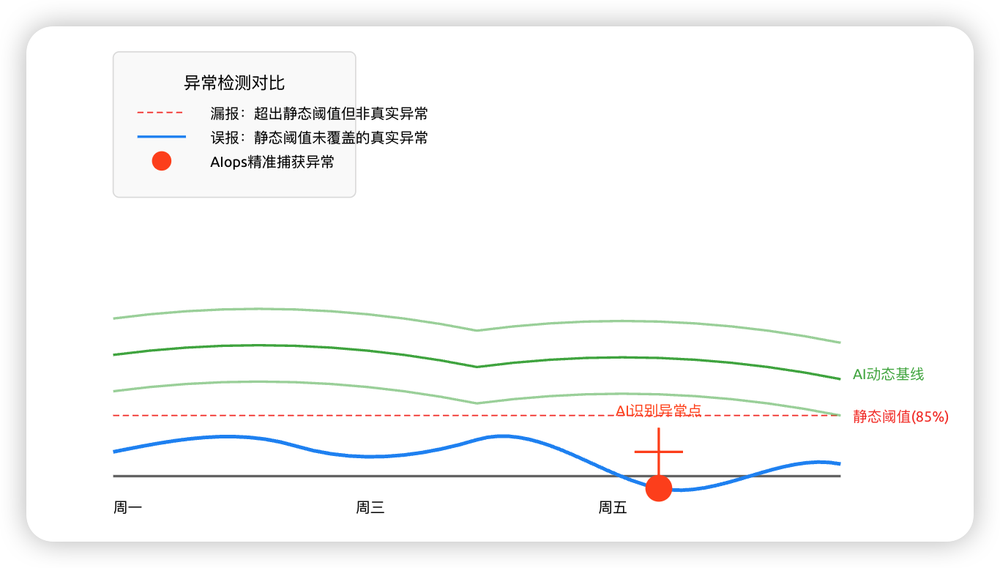
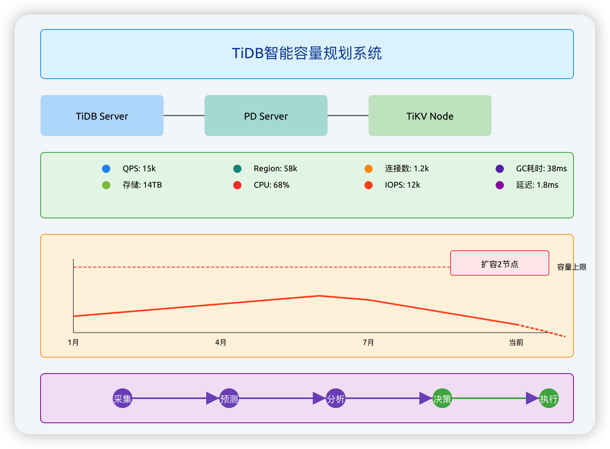
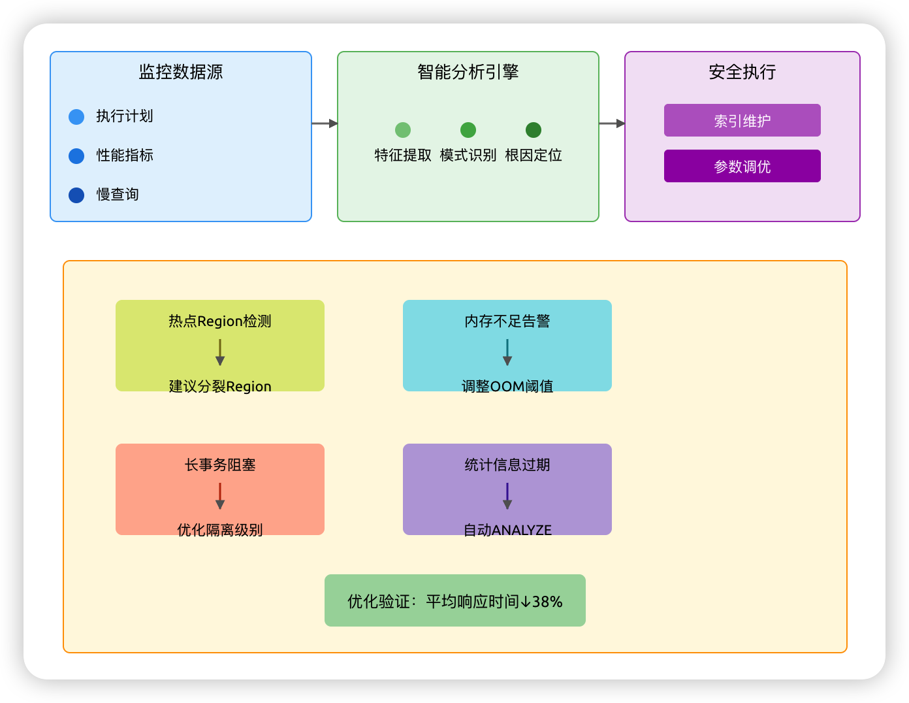
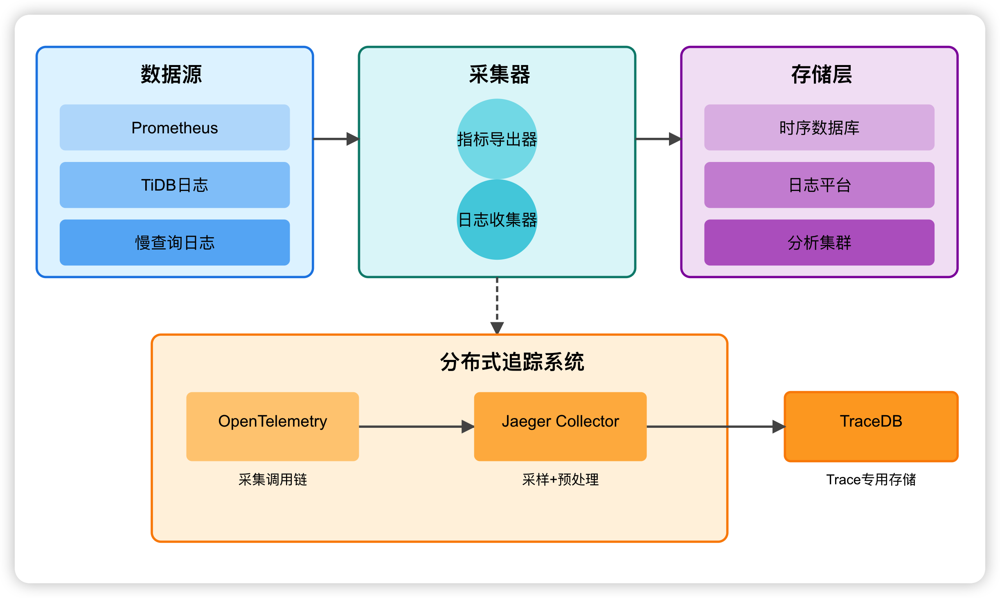

你好，我是悟空。

## 前言

之前我在学习 CodeBuddy AI 编程工具时，就自己搭了一个 MCP Server 用来部署网站，通过对话方式实现自动化部署，算是一个 AiOps 的缩影。

我在工作中不断思考，如何利用 AiOps 的思想来节省运维的成本，提高工作的效率，为公司带来更大的价值，通过在学习 TiDB 的过程中，我们是否可以将 TiDB 和 AiOps 结合在一起了，本篇我们来探讨下。

2016 年，Gartner 创新性地提出了 AIOps 的概念，开创了人工智能辅助运维决策的新篇章。

AIOps 系统能够持续收集 IT 系统的各种运行数据，利用机器学习算法分析这些数据，及时发现异常情况、故障根源，并提供智能化的修复建议。它可以减轻运维人员的工作强度，提高故障处理效率。

而传统的运维方式往往依赖数个具备专业知识的运维人员对某个特定场景下的服务进行监控与决策。随着公司体量的成长，业务场景及数量指数型增长，传统运维将面临着决策时间长、决策难度大、人力成本高等问题，一旦出现重大决策失误，就可能造成巨大的商业损失。然而，海量的数据正好是机器学习的擅长领域。

## 痛点

从 2009 年双十一开始到现在，已经经历了 16 个双十一，数据规模呈现爆发式的增长，业务系统的复杂度也急剧上升，这对开发人员和运维人员的挑战性也更大。

在第一次双十一之后，国内各企业看到了互联网的威力，纷纷开始进行数字化转型，而数据就成为了企业的核心资产，但是互联网的一个特点就是数据量和访问量巨大，**依靠传统的人工经验来运维已经不堪重负了**。

我记得 2018 年国庆的时候，我们产品上线了一个充值币的秒杀活动，**上线前还得提前报备给运维团队**，且需要项目团队预估流量和服务器资源，然后运维同事在活动期间的进行扩容，而且运行期间还需要一名运维同事**专门盯着访问流量和系统性能**，这种传统运维方式凸显出了很多弊端，确实需要做出转变了。

正式在这样的背景下，**TiDB 与 AiOps（智能运维）的结合**，给我们营造了一个数据库智能运维的清晰的蓝图：自动化、智能化、可预测的新模式。

## 为什么 TiDB 需要 AiOps

通过不断地对 TiDB 的学习，我了解到了 TiDB 作为一款先进的分布式数据库，核心优势在与弹性扩缩容、高可用性、强一致性和实时的 HTAP 能力。但是，这些优势也引入了心的复杂度。

### 组件繁多

一个 TiDB 集群就包含了 TiDB-Server、TiKV、PD、TiFlash 等多个组件，监控的指标维度多，数量大。如下图所示，这个是 TiDB 的体系架构。

### 动态性强，容易误报

扩缩容、数据调度、负载均衡等都是动态进行的，传统静态阈值监控方式极易产生误报。

### 根因定位困难

TiDB Server 内部包含多个模块，一个慢查询问题，可能源于 SQL 本身、业务负载激增、TiKV 磁盘 IO、网络延迟或 PD 调度问题，人工排查如同大海捞针。

### 容量规划复杂

传统的运维方式是预估需要的服务器资源，然后乘以 2 倍的资源，就是上线时资源，但随着业务的增长，如何科学地规划硬件资源，避免资源浪费或不足，也是对开发团队和运维团队一个比较大的挑战。

通过上面的几个痛点，我们知道单纯依赖运维人员盯着 Dashboard，手动分析日志和指标，已经无法有效管理大规模的 TiDB 集群了，我们需要更强大的武器 - AiOps。

## AiOps 的宗旨

- 将传统的值班方式改为二十四小时不间断的异常监控和异常处理。

- 将个人的运维经验转变成集体智慧。
- 传统的运维方式往往是处理故障，属于故障发生之后再去止血补救，而智能运维很大程度上赋能了主动运维这个概念，在故障出现前通过一些前兆特征加以规避，或者使故障范围最小化。

## AiOps 能给 TiDB 带来什么？

AiOps 通过融合大数据与机器学习算法，将运维数据（Metrics, Logs, Traces）转化为深入的洞察和自动化的行动。它为 TiDB 运维带来了以下几个核心价值。

### 异常检测与预警：从“被动救火”到“主动预警”

- **传统方式**：我们之前的运维团队都是采用设置静态阈值的方式进行告警，如 CPU 使用率 > 85%，这种方式灵活性差，容易漏报或误报。
- **AiOps 方式**：那现在我们可以利用机器学习算法（如孤立森林、SVM、LSTM），学习每个指标在不同时间段（工作日/周末）的历史正常模式。它能发现人眼难以察觉的微小异常波动，并在潜在问题影响业务前发出预警，实现“治未病”。

如下图所示，这是一个案例的分析：

| 维度       | 静态阈值            | AIops                  |
| ---------- | ------------------- | ---------------------- |
| 响应速度   | 事后报警（已发生）  | 事前预警（提前30min+） |
| 准确率     | 40-60%              | 85-92%                 |
| 运维效率   | 日均处理50+无效告警 | 精准告警（<5条/天）    |
| 自适应能力 | 需手动调整阈值      | 自动适应业务变化       |
| 典型工具   | Nagios/Zabbix       | Prometheus+ML4logs     |

### 根因分析：从“大海捞针”到“一键定位”

- 当问题发生时，系统会采集到数百个关联指标的变化。AiOps 通过相关性分析、拓扑关系图和有向无环图（DAG）等技术，自动分析异常事件之间的因果关系，快速将根本原因定位到具体的组件、机器甚至某个 SQL 语句，极大缩短平均恢复时间（MTTR）。

- 算法选型建议

  - **初级**：Pearson相关系数 + 拓扑传播

  - **中级**：格兰杰因果检验 + PageRank

  - **高级**：贝叶斯结构学习 + 深度因果发现

- 某电商平台实施效果

| KPI      | 改进前  | 改进后 | 提升幅度 |
| :------- | :------ | :----- | :------- |
| MTTR     | 113min  | 16min  | 85%↓     |
| 误报率   | 68%     | 12%    | 82%↓     |
| 宕机损失 | 23万/次 | 3万/次 | 87%↓     |

### 智能容量规划：从“经验猜测”到“数据驱动”

- 通过对历史负载数据（QPS、数据量、CPU/内存/磁盘使用率）进行时间序列分析，AiOps 可以预测未来一段时间（如“618”、“双11”）的业务增长和资源需求。它可以给出科学的扩缩容建议，例如：“根据预测，下月初数据库存储将达到瓶颈，建议提前扩容两个 TiKV 节点”，实现成本与性能的最优平衡。

- 实施效益对比

  | 维度         | 人工规划        | AIops智能规划           |
  | ------------ | --------------- | ----------------------- |
  | 预测周期     | 通常<1周        | 可预测3-6个月           |
  | 准确率       | ±40%误差        | ±15%误差（置信区间95%） |
  | 资源利用率   | 普遍<50%        | 稳定在65-75%            |
  | 应急扩容频率 | 大促期间平均3次 | 趋近于0                 |
  | 典型成本节约 | -               | 基础设施支出降低35%     |

如下图所示，这是一个 TiDB 智能容量规划系统：

### 智能调优与自治：从“手动执行”到“自动优化”

- 我们大胆推测一番，系统可以自动分析慢查询日志，提出索引优化建议，甚至自动创建索引。它可以基于负载模式，自动调整 TiDB 的参数配置。在未来，我们甚至可以期待数据库实现完全的自愈能力，如自动故障转移、自动流量调度等。

- TiDB智能自治系统示例：

  

## TiDB + AiOps 实践路径

### 采集数据

全面、高质量地采集 TiDB 集群的全链路数据。

- **Metrics**：使用 Prometheus 无缝采集 TiDB 丰富的内部监控指标。
- **Logs**：收集 TiDB 各组件的日志，并接入 ELK 或 Loki 等日志平台。
- **Traces**：通过开启分布式链路追踪（如 OpenTelemetry），追踪 SQL 请求的全生命周期。

如下图所示：

### 平台建设

将采集到的数据都接入到 AiOps 平台或数据湖中。

平台需要具备强大的数据加工、算法模型管理和可视化能力。

### 迭代

- 初级阶段：对核心的性能指标实现智能的异常检测。
- 中级阶段：实施根因分析，并指出问题所在以及处理方案。
- 高级阶段：辅助决策、自动化整改，如自动扩容、SQL 优化自动执行等。

## TiDB + AiOps 的优势

我思考了，TiDB 相比其他的数据库真的是具有天然的优势：

- 因为 TiDB 本身根据具有丰富的监控指标，为机器学习提供了高质量的数据源。

- 且 TiDB 完美支持 Prometheus、Grafana 等云原生监控生态，易于集成。

- 以及它的分布式架构，无状态计算层（TiDB-Server）和弹性存储层（TiKV）的设计，使得自动化扩缩容等非常方便。

## 总结

TiDB + AiOps 的结合，我觉得不是 1+1 的计算题，而是思维的转变，一场深刻的运维变革。就像现在我们团队一直用 Jenkins 来打包部署，和之前的人工打包相比，真的是彻底解放了双手，部署的时候还能喝一杯咖啡。而 TiDB + AiOps 可以将 DBA 从繁琐重复的日常监控和救火中解放出来，使其能更加专注于数据库架构设计、性能优化等更高层次的工作。

我之前写过 TiDB MCP Server 的实践文章，通过自然语言查询数据、操作数据库，我相信在未来，随着 AI Agent 的不断发展，我们可以通过自然语言与这套结合的系统进行交互，比如帮我分析下昨天的数据库性能瓶颈，或者帮我整理一份双十一的资源扩容计划等等。而 TiDB 依据自身架构的天然优势、以及开放的生态、友好的社区氛围，将走在这场变革的最前沿，真心祝愿 TiDB 越走越好！
