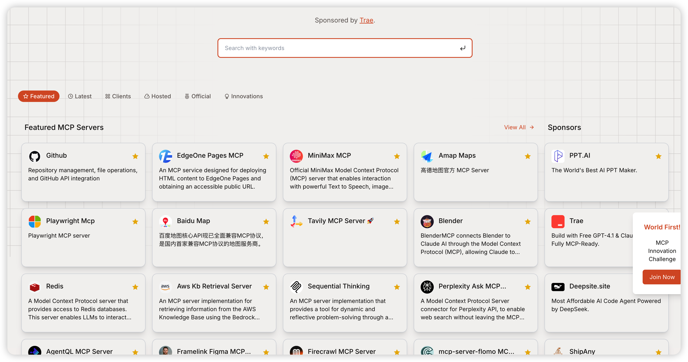
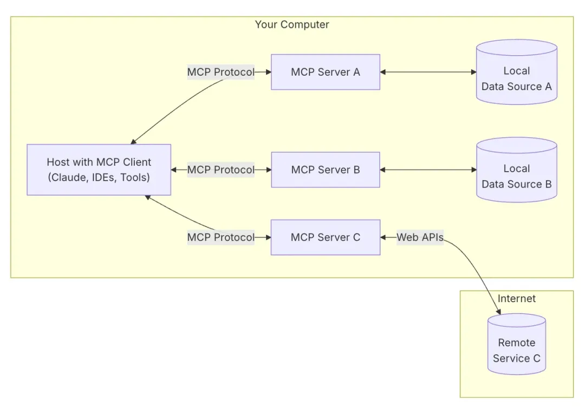
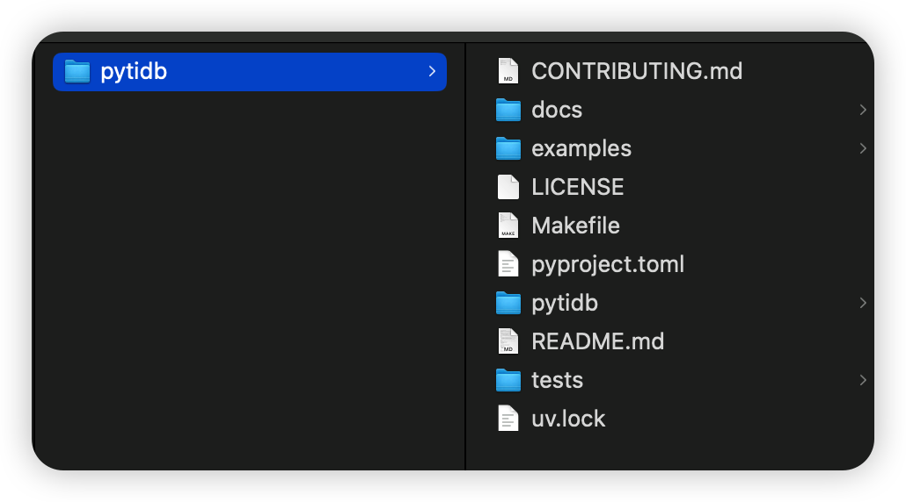
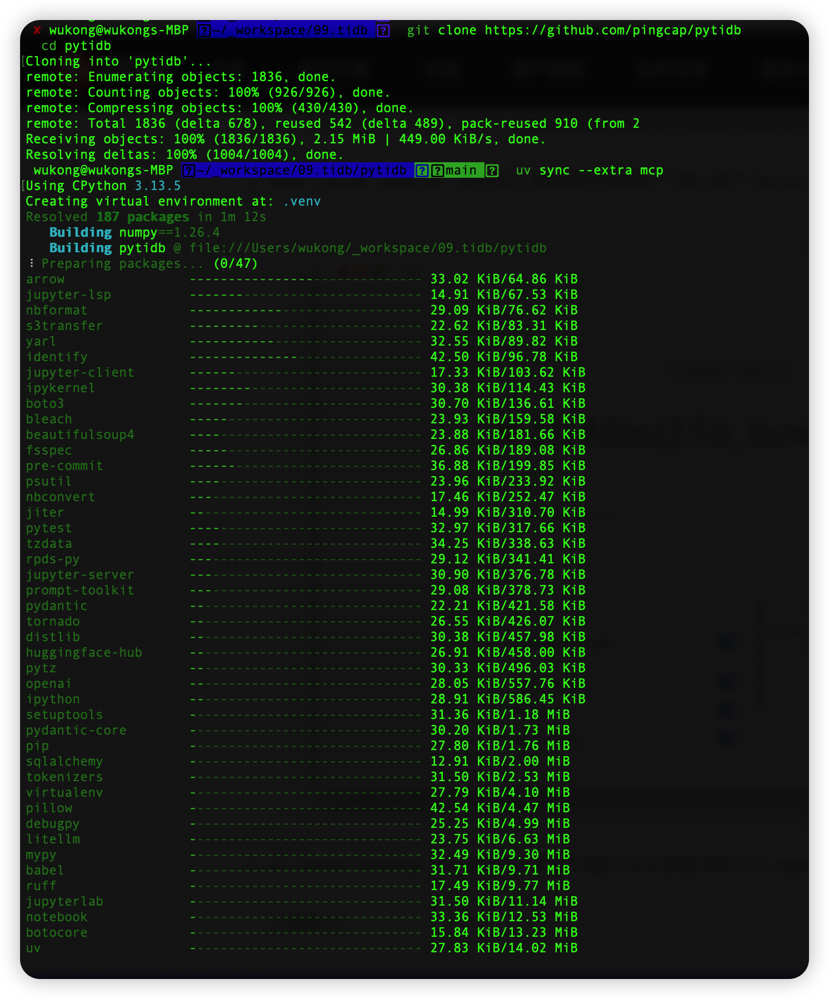
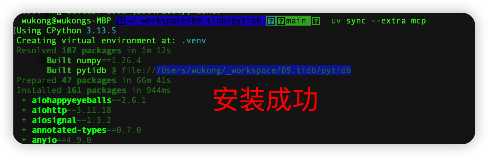
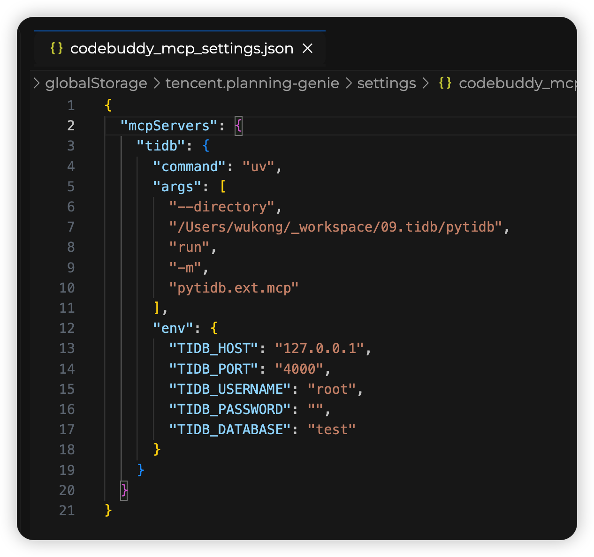
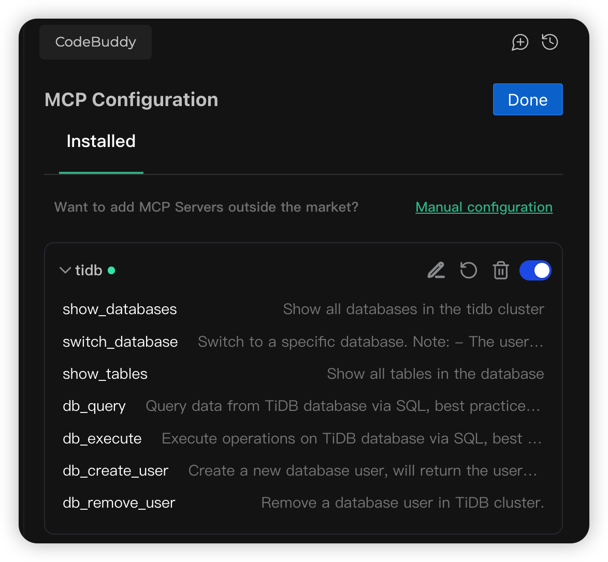
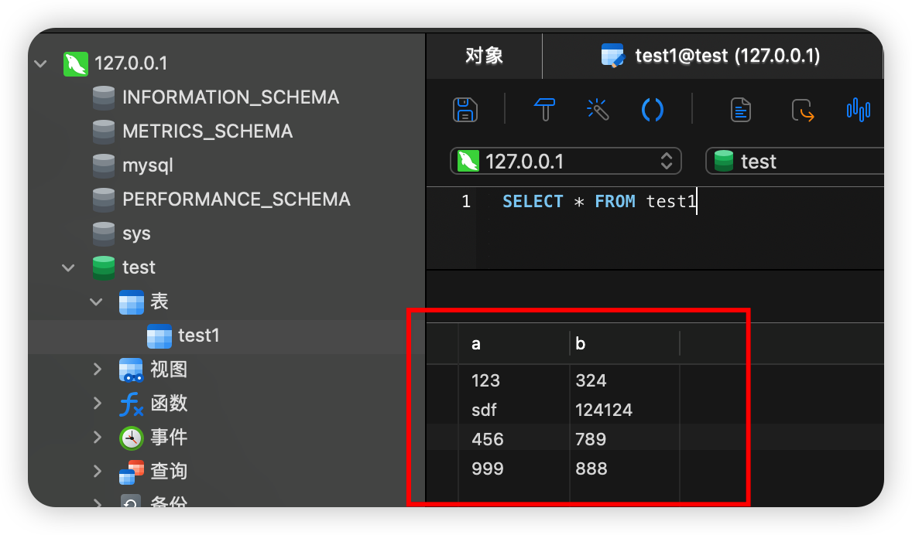
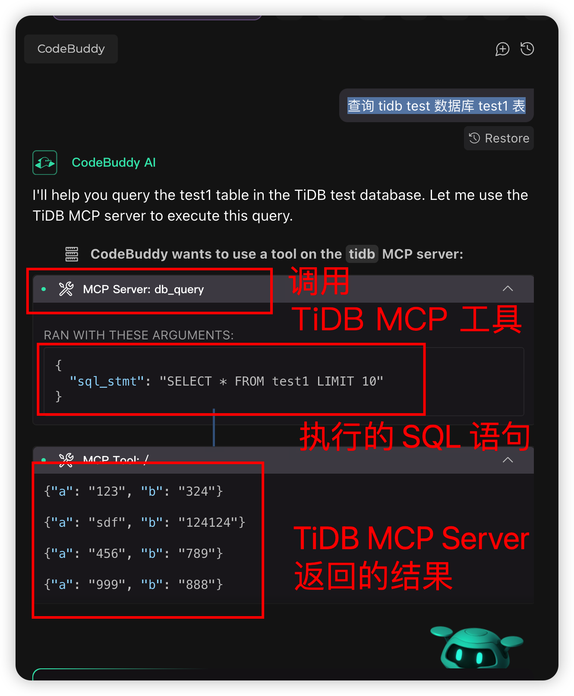

你好，我是悟空。

## 前言

TiDB 已经支持 MCP 功能了，一直想看看怎么玩的，本篇是一篇实践篇，带着大家一起搭建 TiDB MCP Server，以及如何添加 TiDB MCP，如何使用 TiDB 的 MCP。

### 演示环境说明

- 可以连接使用的的 TiDB 数据库，且连接时不需要证书、隧道等。
- Mac M1，32G 内存。
- CodeBuddy 工具，用来配置 MCP 服务和生成式对话，也可以用其他工具，如 Cursor、Cline。

## MCP Server 添加方式

有两种方式添加 TiDB MCP Server：

- 本地部署 MCP Server。原理就是从 github 拉取最新代码，然后本地部署 TiDB MCP Server。
  - 优势：可以用最新的代码，上面有新的功能和 bug 修复。
  - 缺点：需要下载代码、安装依赖、启动等，对使用者要求比较高。
- 添加应用市场中 MCP Server。原理就是在 MCP 应用市场查找 TiDB MCP Server，然后添加到 AI 开发工具上。（截止 2025-09-09 在https://mcp.so/没有搜到官方的 TiDB MCP Server）
  - 优势：简单方便。
  - 缺点：MCP Server 可能不是最新的，有些功能特性和 bug 修复不在当前版本上。

本篇只介绍本地部署 TiDB MCP Server 的方式。

## MCP 介绍

2024 年 11 月，Anthropic 公司搞了个挺有意思的新玩意 - Model Context Protocol（模型上下文协议）简称为 MCP 协议。简单来说，它就是给 AI 和各类工具数据之间搭了个标准化的”桥梁”，让开发者不用再为对接问题头疼了。

大模型应用可以使用别人分享的 MCP 服务来完成各种各样的工作内容，你可以从这些地方获取 MCP 服务：

- awesome-mcp-servers
- mcp.so

如下图所示，这是 mcp.so 网站中的 MCP Server。



MCP 协议在实际的应用场景上非常广泛，列举一些比较常见的应用场景：

- 使用百度/高德地图分析旅线计算时间
- 接 Puppeteer 自动操作网页
- 使用 Github/Gitlab 让大模型接管代码仓库
- 使用数据库组件完成对 Mysql、ES、Redis 等数据库的操作
- 使用搜索组件扩展大模型的数据搜索能力

## MCP 的架构

**MCP 的架构**

MCP 主要分为 MCP 服务和 MCP 客户端：

- 客户端：一般指的是大模型应用，比如 Claude、通过 Spring AI Alibaba、Langchain 等框架开发的 AI 应用
- 服务端：连接各种数据源的服务和工具

整体架构如下：



整体的工作流程是这样的：AI 应用中集成 MCP 客户端，通过 MCP 协议向 MCP 服务端发起请求，MCP 服务端可以连接本地/远程的数据源，或者通过 API 访问其他服务，从而完成数据的获取，返回给 AI 应用去使用。

## 本地部署 TiDB MCP Server

### 克隆 PyTiDB 项目

github 地址：https://github.com/pingcap/pytidb/

该项目内含 MCP Server 模块，将代码仓库到本地

```sh
git clone https://github.com/pingcap/pytidb
cd pytidb
```



### 安装 Python 开发环境及依赖

推荐使用 uv 包管理工具：https://docs.astral.sh/uv/

```sh
uv sync --extra mcp
```





## 配置 MCP 客户端

以 CodeBuddy 工具为例，添加 TiDB MCP Server 的配置参数。

如下图所示，args 参数配置的是本地的 TiDB MCP Server 的执行路径，env 配置的是本地的 TiDB 数据库连接。



可以看到 TiDB MCP Server 添加成功，展示了 7 种 tool：



- show_databases：展示该 tidb 集群种所有的数据库。
- Switch_database：切换到指定的数据库。
- show_tables：展示该数据库种的所有的表。
- db_query：从 TiDB 数据库通过 SQL 查询数据，使用 limit 限制返回条数，避免返回过多数据造成性能问题。
- db_execute：通过 SQL 执行相关操作。
- db_create_user：创建用户。
- db_remove_user：移除用户。

### 测试 TiDB MCP Server 是否正常工作

先往 test1 表插入几条测试数据，如下图所示：



然后在 CodeBuddy 的聊天窗口进行对话：

> 查询 tidb test 数据库 test1 表

然后 CodeBuddy 会调用 TiDB MCP Server 的工具：db_query 从本地数据库中查询数据。



返回的 4 条数据和数据库的结果一致，说明 TiDB MCP Server 是成功部署的。

通过该实验，我们可以考虑更多的玩法，通过对话的方式来查询数据，无需编写 SQL 语句，应用到某些产品中，极大的节省了开发成本。

## 关于 TiDB MCP Server 应用场景

结合对话式交互的天然优势，我们可以进一步探索以下创新玩法和应用场景，覆盖从开发到业务、从内部到外部的全链路价值：

### 1、自然语言即服务（NLaaS）：零 SQL 的数据洞察平台

**场景**：业务人员、产品经理、运营等非技术角色，直接通过自然语言查询 TiDB 中的数据。

### 2、智能开发助手：SQL 自动生成与优化

**场景**：开发者在 IDE 中通过自然语言描述需求，自动生成 TiDB 兼容的 SQL 语句。

### **3. 实时运维巡检：对话式故障定位**

**场景**：DBA 或运维人员通过对话快速排查 TiDB 集群异常。

关于传统方式和 TiDB MCP Server 对话式的总结

| 维度     | 传统方式                       | TiDB MCP Server 对话式         |
| -------- | ------------------------------ | ------------------------------ |
| **效率** | 写 SQL → 调试 → 结果（10分钟） | 一句话 → 结果（10秒）          |
| **门槛** | 需懂 SQL、表结构               | 零技术背景即可查询             |
| **场景** | 固定报表、预定义查询           | 临时需求、探索式分析、实时运维 |
| **成本** | 开发人力、沟通成本             | 自动化生成，节省80%人力        |

## 总结

本文通过实践演示了如何搭建与使用 TiDB MCP Server，展示了本地部署的接入方式，验证了通过自然语言即可查询 TiDB 数据的可行性。TiDB MCP Server 提供了数据库查询、用户管理等 7 种工具，结合 CodeBuddy 等 AI 工具，可实现零 SQL、对话式的数据交互，大幅降低数据查询门槛。文章还展望了其在业务洞察、智能开发、运维巡检等场景的应用潜力，对比传统方式，TiDB MCP 对话式交互在效率、门槛、灵活性与成本上具备显著优势，为 AI 驱动的数据操作提供了新范式。

## 在键盘与烟火之间

上周日和领居家的小朋友一起到金银湖湿地公园玩耍，我们家太积极了，过完早就在他们家楼下等，和娃玩了半个小时飞盘🥏。

然后去公园集合，在等他们家的时候，我在公园和大爷们一起踢毽子，四个人一组，保持毽子不掉地。记得初中的时候，我每天下课和中午都会踢毽子，由于踢得太多，还被老师拉到办公室谈话了，让我一个人在外面一直踢，记得踢了很久，老师又把我叫回来了，还给我吃了一根香蕉🍌，让我以后少踢点，哈哈～但是我丝毫没有减少踢的时间，我真的太喜欢这个运动了！今天回家后，大腿好酸，用力过猛了。

在公园这两个小孩觉得不好玩，我就带着他们玩，毕竟出都出来了，得让他们玩得开心。

这一周是开学的第二周，家庭作业不多，就是早上要起得更早了，之前都是娃的奶奶做早餐，今天我起了个早床，给娃做了一份番茄意大利面🍜，娃和娃妈都觉得特别好吃～

我是悟空，在键盘⌨️与烟火🎆之间，记录生活的点点滴滴。
