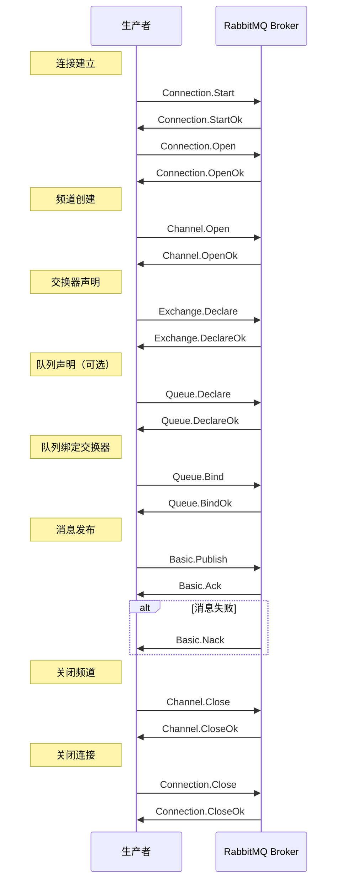

```mermaid
sequenceDiagram
    participant P as 生产者
    participant S as RabbitMQ Broker

    %% 连接建立
    Note left of P: 连接建立
    P->>S: Connection.Start
    S->>P: Connection.StartOk
    P->>S: Connection.Open
    S->>P: Connection.OpenOk

    %% 频道创建
    Note left of P: 频道创建
    P->>S: Channel.Open
    S->>P: Channel.OpenOk

    %% 交换器声明
    Note left of P: 交换器声明
    P->>S: Exchange.Declare
    S->>P: Exchange.DeclareOk

    %% 队列声明（可选）
    Note left of P: 队列声明（可选）
    P->>S: Queue.Declare
    S->>P: Queue.DeclareOk

    %% 队列绑定交换器
    Note left of P: 队列绑定交换器
    P->>S: Queue.Bind
    S->>P: Queue.BindOk

    %% 消息发布
    Note left of P: 消息发布
    P->>S: Basic.Publish
    S->>P: Basic.Ack
    alt 消息失败
        S->>P: Basic.Nack
    end

    %% 关闭频道
    Note left of P: 关闭频道
    P->>S: Channel.Close
    S->>P: Channel.CloseOk

    %% 关闭连接
    Note left of P: 关闭连接
    P->>S: Connection.Close
    S->>P: Connection.CloseOk

```
