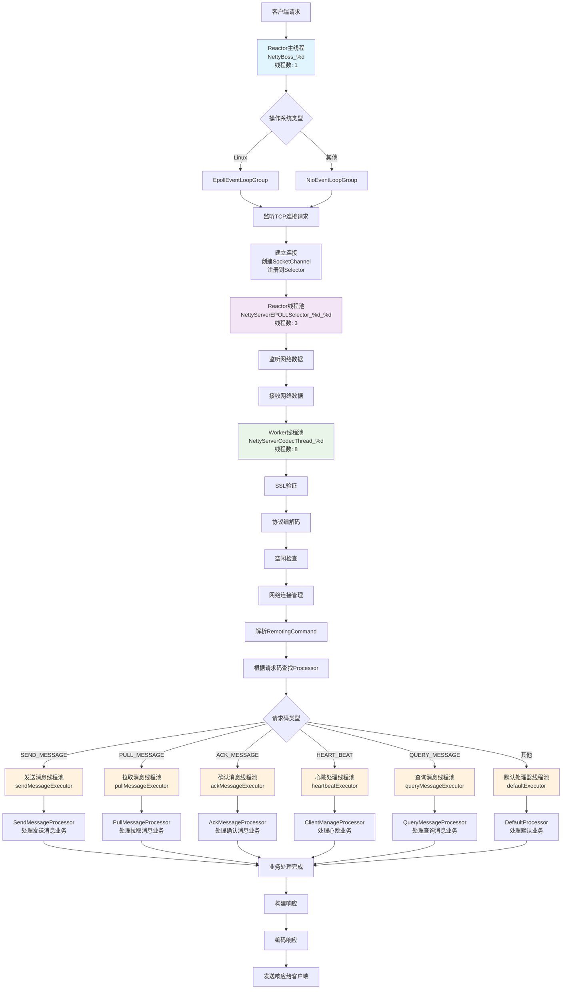
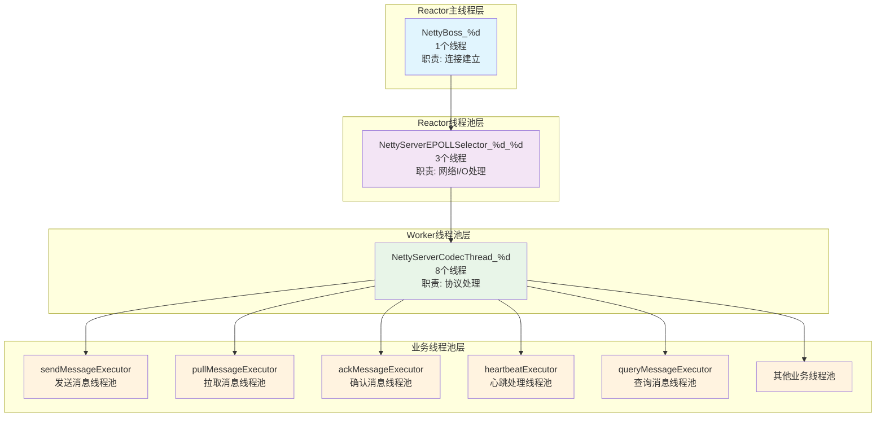
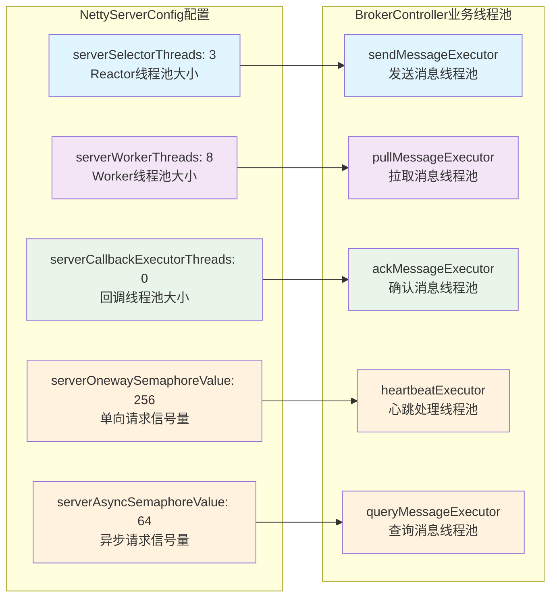
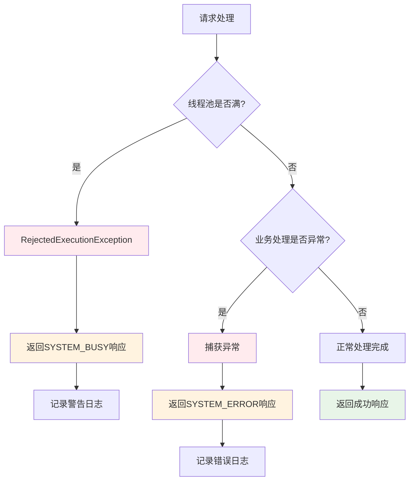

## 线程池层次结构

## 关键配置参数

## 异常处理流程

#### 2. **主节点（Master）与从节点（Slave）的关系**

| **机制**     | **说明**                                                                                         |
| :----------- | :----------------------------------------------------------------------------------------------- |
| **数据同步** | 主节点**异步/同步**复制消息到从节点 （通过 `brokerRole=ASYNC_MASTER/SYNC_MASTER/SLAVE` 配置） |
| **故障接管** | 主节点宕机时，从节点**不会自动升主** （需运维干预或依赖 RocketMQ 5.0 的 Dledger 自动选主）    |
| **读扩散**   | 消费者默认从主节点读 高负载时可配置 `consumeFromWhere=CONSUME_FROM_SLAVE` 从从节点读          |

> ⚠️ **注意**：
>
> - **主从切换非自动**：传统架构需人工介入（如重启 Broker 切换角色）；
> - **5.0 改进**：Dledger 模式支持基于 Raft 协议自动选主（类似 Kafka Controller）。
